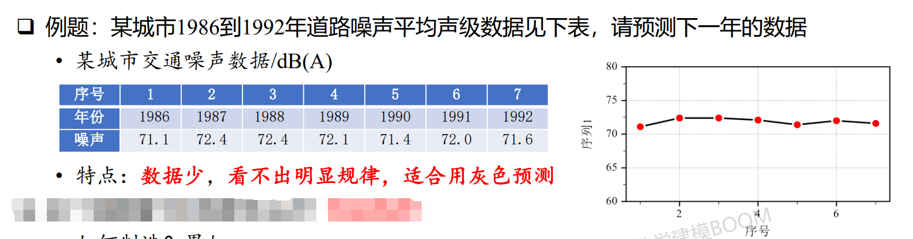

# GM(1,1)灰色预测
---
## 模型简介
### 名词释义
- **模型名称解释：G：grey（灰色），M：model（模型），（1,1）：只含有一个变量的一阶（导数阶最高为1）微分方程模型**
- 白色系统
    - **典型例子：电阻器件**
    - **特点：内部特征是完全已知的**，电压、电流和电阻之间的关系（欧姆定律）是已知的
    - 知道电阻大小后，输入电压值，就能算出电流值
    - 白色系统可 **“计算”** 出想要的结果
- 黑色系统
    - **典型例子：一辆车**
    - **特点：内部特征是完全未知的**（对于开车的人来说，黑盒）
    - 非专业认识虽然可以控制汽车，然而内部出现故障时并不能修理
    - 黑色系统具有 **“不可知性”**
- 灰色系统
    - **典型例子：GDP**
    - 特点：介于黑色和白色之间，**部分已知，部分未知**，具有**小样本数据的不确定性**系统
    - 我们有往年的数据和一定的理论基础（**白色**）
    - 但无法精确计算得出下一年的值（**黑色**）
    - 灰色无法 “计算”， 但并不是完全 “不可知”，可以进行 **“预测”**

## 灰色预测的主要步骤
1. 根据原始数据，通过**累加等**方式**削弱随机性、获得有规律**的新序列
2. 建立相应的**微分方程**模型，得到离散点处的解
3. 再通过累减求得的原始数据的估计值，从而对原始数据**预测**
4. 整体思路见下图：
<br>


## 适用赛题
- 数列预测
    - **特点：定时求量**，已知 xx 年到 xx 年的**数据**，请预测下一年的数值
    - 常见于 **GDP、人口数量、耕地面积、粮食产量**等问题
    - 针对的问题往往**短期波动小、可预测，但长期可能变化大、难以准确预测**
- 灾变预测
    - **特点：定量求时**，已知 xx 年到 xx 年的**数据**和某灾变的**阈值**，预测下一次灾变发生的时间
    - 常见**洪涝灾害、虫灾**等问题
    - 模型中需要把超出阈值的数据（异常数据）**对应的时间**组成新序列
- 拓扑预测
    - **特点：对数据波形进行预测**，求的是多个模型构成的模型群，**等于求解多个灾变预测**
    - 与灾变预测类似，不过有较详细的分级，例如虫灾“轻微”“中度”“重度”
- 模型使用注意事项
    - **只适用于少量的数据**，数据量太多了没意义，例如用近 100 年的 GDP 去预测下一年毫无意义
    - **只能短期预测**，究竟多短没有严格限制

## 使用步骤讲解
使用步骤讲解将结合以下例题进行：

### 获得有规律新序列
设原数据为 $x^{(0)}$，新序列生成的值为 $x^{(1)}$ ，生成方式如下（累加）：
$$
    x^{(1)}(k) = \sum_{i=1}^{k}x^{(0)}(i)
$$

此举后，原序列的随机性被弱化，新生成的序列呈现出规律性：


### 建立微分方程
- 画出 $t-x^{(1)}$ 曲线，可以看出其呈直线趋势，于是，我们可以用一个指数曲线来逼近这个曲线
- 相应地，一阶常微分方程的解为指数曲线，因此我们可以构建一阶常微分方程，通过求解来获得这个曲线方程的近似表达式


于是，我们建立如下一阶常微分方程：
$$
    \frac{dx^{(1)}}{dt}+ax^{(1)}=u
$$

要解这个微分方程，我们需要知道参数 $a$ 和 $u$ 的值，所以下一步我们来求这两个参数的值

### 求解参数 $a$ 和 $u$
- 进行如下的简化：
    1. 已知 $\frac{dx^{(1)}}{dt}+ax^{(1)}=u$ 中的数据是离散的，所以 $\frac{dx^{(1)}}{dt}$ 可以写成 $\frac{\Delta x^{(1)}}{\Delta t}$
    2. 因为 $\Delta t = t - (t-1)$，所以其值始终为 1，而 $\Delta x^{(1)} = x^{(1)}(t) - x^{(1)}(t-1)= x^{(0)}(t)$
    3. 于是微分方程 $\frac{dx^{(1)}}{dt}+ax^{(1)}=u$ 可化简为 $x^{(0)}(t)=-ax^{(1)}+u$
    4. 目前已知 $x^{(0)}(t)$ 和 $x^{(1)}(t)$ 的实际数据，以及两者的函数关系式，此时可以用最小二乘法求解参数 $a$ 和 $u$

- 考虑到原方程中有 $\frac{\Delta x^{(1)}}{\Delta t}$，因此我们将 $x^{(1)}(t)$ 修正为 $z^{(1)}(t)$，以进一步消除数据的随机性，其中：
$$
    z^{(1)}(t) = 1/2[x^{(1)}(t) + x^{(1)}(t-1)], t=2,...,n
$$

- 即方程改为：$x^{(0)}(t)=-az^{(1)}+u$
- 设该方程的矩阵形式为 $Y=BU$，即
$$
    \begin{bmatrix}x^{(0)}(2) \\ x^{(0)}(3)\\ \vdots \\ x^{(0)}(n)
    \end{bmatrix} = \begin{bmatrix}
    -\frac{1}{2}[x^{(1)}(2) + x^{(1)}(1)] & 1\\ -\frac{1}{2}[x^{(1)}(3) + x^{(1)}(2)] & 1\\ \vdots \\ -\frac{1}{2}[x^{(1)}(n) + x^{(1)}(n-1)] & 1
    \end{bmatrix} * \begin{bmatrix}a\\ u \end{bmatrix}
$$ 
- 注意：Y 从第二项开始。通过最小二乘法，可以得到 $U$ 的估计值为 $\hat{U}=[\hat{a},\hat{b}]^T=(B^TB)^{-1}B^TY$，即求出了参数的估计值 $\hat{a},\hat{b}$ 

### 解一阶常微分方程
下面介绍如何解一阶常微分方程：
#### 标准形式
给定初始条件的一阶常微分方程（组）的标准形式是：
$$
    \begin{cases}
    \frac{dy}{dt}=f(y,t)\\
    y(t_0)=y_0
    \end{cases}
$$

式中的 $y$ 在常微分方程中是标量，在常微分方程组中是数组向量
#### scipy.integrate.odeint() 函数
- SciPy 提供了两种方式求解常微分方程：基于 odeint 函数的 API 比较简单易学，基于 ode 类的面向对象的 API 更加灵活。
- **scipy.integrate.odeint()** 是求解微分方程的具体方法，通过数值积分来求解常微分方程组。在 odeint 函数内部使用 FORTRAN 库 odepack 中的 lsoda，可以求解一阶刚性系统和非刚性系统的初值问题。

```python
scipy.integrate.odeint(func, y0, t, args=(), Dfun=None, col_deriv=0, full_output=0, ml=None, mu=None, rtol=None, atol=None, tcrit=None, h0=0.0, hmax=0.0, hmin=0.0, ixpr=0, mxstep=0, mxhnil=0, mxordn=12, mxords=5, printmessg=0, tfirst=False)
```
**主要参数：**
|参数|说明|
|:-:|:-:|
|func: callable(y, t, …) |导数函数 $f ( y , t )$，即 y 在 t 处的导数，以函数的形式表示|
|y0: array|初始条件 $y_0$，对于常微分方程组则为数组向量|
|t: array|求解函数值对应的时间点的序列。序列的第一个元素是与初始条件 $y_0$ 对应的初始时间 $t_0$；时间序列必须是单调递增或单调递减的，允许重复值|

**其他参数：**
|参数|说明|
|:-:|:-:|
|args|向函数 func 传递的参数|
|Dfun|函数 func 的雅可比矩阵|
|col_deriv|自动推导 Dfun 的方式|
|printmessg|布尔值。控制是否打印收敛信息|

**主要返回值：**
**y(array): 数组，形状为 (len(t), len(y0))，给出时间序列 t 中每个时刻的 y 值。**

#### 实例1
**求下列一阶常微分方程的数值解:**
$$
    \begin{cases}
    \frac{dy}{dt}=\sin (t^2) \\
    y(-10)=1
    \end{cases}
$$

**步骤：**
1. 导入 scipy、numpy 包
2. 定义导数函数 $f(y,t)=\sin (t^2)$
3. 定义初值 $y_0$ 和 y 的求解区间 $[t_0,t]$
4. 调用 odeint() 求 y 在求解区间 $[t_0,t]$ 的数值解

**代码如下：**
```python
# 1. 求解微分方程初值问题(scipy.integrate.odeint)
from scipy.integrate import odeint  # 导入 scipy.integrate 模块
import numpy as np

def dy_dt(y, t):  # 定义函数 f(y,t)
    return np.sin(t**2)

y0 = [1]  # y0 = 1 也可以
t = np.arange(-10,10,0.01)  # (start,stop,step)
y = odeint(dy_dt, y0, t)  # 求解微分方程初值问题
```
#### 实例2
**求解下列一阶常微分方程组的数值解：**
$$
    \begin{cases}
    \frac{dx}{dt}=\sigma (y-x) \\
    \frac{dy}{dt}=x(\rho -z)-y \\
    \frac{dz}{dt}=xy- \beta z
    \end{cases}
$$

**步骤：**
1. 导入 scipy、numpy 包
2. 定义导数函数 lorenz(W, t, p, r, b)，注意odeint() 函数中定义导数函数的标准形式是 $f ( y , t )$，对于微分方程组 y 表示向量。为避免混淆，我们记为 $W = [x,y,z]$，函数 lorenz(W,t) 定义导数函数 $f(W,t)$，用 p,r,b 分别表示方程中的参数 σ 、ρ 、β 
3. 定义初值 $W_0$ 和 $W$ 的求解区间 $[t_0,t]$
4. 调用 odeint() 求 $W$ 在定义区间 $[t_0,t]$ 的数值解

**代码如下：**
```python
# 2. 求解微分方程组初值问题(scipy.integrate.odeint)
from scipy.integrate import odeint    # 导入 scipy.integrate 模块
import numpy as np

# 导数函数, 求 W=[x,y,z] 点的导数 dW/dt
def lorenz(W,t,p,r,b):  
    x, y, z = W  # W=[x,y,z]
    dx_dt = p*(y-x)  # dx/dt = p*(y-x), p: sigma
    dy_dt = x*(r-z) - y  # dy/dt = x*(r-z)-y, r:rho
    dz_dt = x*y - b*z  # dz/dt = x*y - b*z, b;beta
    return np.array([dx_dt,dy_dt,dz_dt])

t = np.arange(0, 30, 0.01)  # 创建时间点 (start,stop,step)
paras = (10.0, 28.0, 3.0)  # 设置 Lorenz 方程中的参数 (p,r,b)

# 调用ode对lorenz进行求解, 用两个不同的初始值 W1、W2 分别求解
W1 = (0.0, 1.00, 0.0)  # 定义初值为 W1
track1 = odeint(lorenz, W1, t, args=(10.0, 28.0, 3.0))  # args 设置导数函数的参数
W2 = (0.0, 1.01, 0.0)  # 定义初值为 W2
track2 = odeint(lorenz, W2, t, args=paras)  # 通过 paras 传递导数函数的参数
```

#### 实例3
**求下列二阶常微分方程的数值解：**
$$
\left\{\begin{array}{l}
\frac{\mathrm{d}^2 \mathrm{u}}{\mathrm{dt}^2}+\frac{\mathrm{R}}{\mathrm{L}} * \frac{\mathrm{du}}{\mathrm{dt}}+\frac{1}{\mathrm{LC}} * \mathrm{u}=0 \\
\mathrm{u}(0)=\mathrm{U}_0 \\
\mathrm{u}^{\prime}(0)=0
\end{array}\right.
$$

令 $ \alpha = R/2L$，$\omega_0^2=1/LC$，在零输入响应 $u_s=0$ 时上式可以写成：
$$
\left\{\begin{array}{l}
\frac{\mathrm{d}^2 \mathrm{u}}{\mathrm{dt}^2}+2 \alpha \frac{\mathrm{du}}{\mathrm{dt}}+\omega_0^2 \mathrm{u}=0 \\
\mathrm{u}(0)=\mathrm{U}_0 \\
\mathrm{u}^{\prime}(0)=0
\end{array}\right.
$$

对二阶微分方程问题，引入变量 $ v = du/dt$，通过变量替换就把原方程化为如下的微分方程组：
$$
\left\{\begin{array}{l}
\frac{\mathrm{du}}{\mathrm{dt}}=\mathrm{v} \\
\frac{\mathrm{dv}}{\mathrm{dt}}=-2 \alpha \mathrm{v}-\omega_0^2 \mathrm{u} \\
\mathrm{u}(0)=\mathrm{U}_0 \\
\mathrm{v}(0)=0
\end{array}\right.
$$

**代码如下：**
```python
# 3. 求解二阶微分方程初值问题(scipy.integrate.odeint)
# Second ODE by scipy.integrate.odeint
from scipy.integrate import odeint  # 导入 scipy.integrate 模块
import numpy as np

# 导数函数，求 Y=[u,v] 点的导数 dY/dt
def deriv(Y, t, a, w):
    u, v = Y  # Y=[u,v]
    dY_dt = [v, -2*a*v-w*w*u]
    return dY_dt

t = np.arange(0, 20, 0.01)  # 创建时间点 (start,stop,step)
# 设置导数函数中的参数 (a, w)
paras1 = (1, 0.6)  # 过阻尼：a^2 - w^2 > 0
paras2 = (1, 1)  # 临界阻尼：a^2 - w^2 = 0
paras3 = (0.3, 1)  # 欠阻尼：a^2 - w^2 < 0

# 调用ode对进行求解, 用两个不同的初始值 W1、W2 分别求解
Y0 = (1.0, 0.0)  # 定义初值为 Y0=[u0,v0]
Y1 = odeint(deriv, Y0, t, args=paras1)  # args 设置导数函数的参数
Y2 = odeint(deriv, Y0, t, args=paras2)  # args 设置导数函数的参数
Y3 = odeint(deriv, Y0, t, args=paras3)  # args 设置导数函数的参数
# W2 = (0.0, 1.01, 0.0)  # 定义初值为 W2
# track2 = odeint(lorenz, W2, t, args=paras)  # 通过 paras 传递导数函数的参数
```
附：上述内容参考自：[Python小白的数学建模课-09.微分方程模型](http://t.csdnimg.cn/3fZqn)


### 模型检验
模型靠不靠谱？需要进行**模型检验**
- 相对误差检验：
$$
    \varepsilon(k) = \frac{|x^{(0)}(k)-\hat{x}^{(0)}(k)|}{x^{(0)}(k)}
$$
如果 $\varepsilon(k) < 0.2$，可以认为达到一般要求；如果 $\varepsilon(k) < 0.1$，即达到较高要求
- 级比偏差检验：
$$
    \rho(k)=1-\frac{1-0.5a}{1+0.5a}\lambda(k)
$$
其中级比 $\lambda(k)=\frac{x^{(0)}(k-1)}{x^{(0)}(k)}$
如果 $|\rho(k)| <0.2$，可以认为达到一般要求；如果 $|\rho(k)| <0.1$，可以认为达到较高要求
- 如果大于 0.2 怎么办？换模型吧...灰色预测不适合本题

### 原始数据的级比检验
在建模**最开始**，需要进行数据的级比检验
- 为了确定**原始数据**使用 GM(1,1) 模型的**可行性**，避免白忙活，需要对原始数据进行级比检验
- 计算 $\lambda(k)=\frac{x^{(0)}(k-1)}{x^{(0)}(k)},k=2,3...,n$
- 如果 $\lambda(k)$ 在区间 $(e^{-\frac{2}{n+1}},e^{\frac{2}{n+2}})$ 内，说明可用 GM(1,1) 模型
- 如果在区间外，可以尝试平移变换，也就是给每个数据都加上任意常数 c 后看是否在区间内；求解后再减去c
- 如果尝试多次平移变换后始终无法在区间内，说明题目不适合灰色预测

### 讲解例题的代码求解
下面是该讲解例题的代码求解：

```python
import numpy as np
from scipy.integrate import odeint
from matplotlib import pyplot as plt

data = np.array([71.1,72.4,72.4,72.1,71.4,72.0,71.6])
n = len(data)
# 原始数据的级比检验
lmda = []
for i in range(1, n):
    lmda.append(data[i-1] / data[i])
    
left =  np.exp(-2 / (n+1))
right = np.exp(2/(n+2))
for i in range(len(lmda)):
    if lmda[i] <= left or lmda[i] >= right:
        print("第", i+1, "个lambda未通过级比检验")

# 获得有规律的新序列
newData = np.array([sum(data[: i]) for i in range(1,n + 1)])
# print(newData)

# 建立微分方程
def func(x,t,a,u):
    return -a*x+u;

# 获取修正变量z
z = np.array([-0.5*(newData[i] + newData[i+1]) for i in range(n-1)])
# print(z)
Y = data[1 : n].reshape(-1, 1)
B = np.column_stack((z, np.ones(6)))
# print(Y)
# print(B)

U = np.linalg.inv((B.T @ B)) @ B.T @ Y
# print(U)

# 解一阶线性方程
a, u = U[0], U[1]
args = (U[0], U[1])
t = np.arange(1, 9, 1)
y0 = [71.1]
y = odeint(func, y0, t, args=args)

plt.plot(t, y)
print("y:",y)
print("下一年的道路噪声平均声级数据为:", y[len(y)-1] - y[len(y)-2])

dataDeduce = []
for i in range(1, len(y)):
    dataDeduce.append(y[i][0] - y[i-1][0])

var = [abs(data[i]-dataDeduce[i]) / data[i] for i in range(len(data))]
rho = [1 - ((1-0.5*a) / (1+0.5*a)) * lmda[i] for i in range(len(lmda))]

print("对于数据var:")
for i in range(len(var)):
    if var[i] < 0.1:
        print("第",i+1,"个数据达到较高要求")
    elif var[i] < 0.2:
        print("第",i+1,"个数据达到一般要求")
    else:
        print("第",i+1,"个数据未达到要求")
    
print("对于数据rho:")        
for i in range(len(rho)):
    if rho[i] < 0.1:
        print("第",i+1,"个数据达到较高要求")
    elif rho[i] < 0.2:
        print("第",i+1,"个数据达到一般要求")
    else:
        print("第",i+1,"个数据未达到要求")
```
**运行结果：**
```python
y: [[ 71.1       ]
 [143.50574241]
 [215.74197897]
 [287.80910747]
 [359.7075238 ]
 [431.43762292]
 [502.99979888]
 [574.39444478]]
下一年的道路噪声平均声级数据为: [71.3946459]
对于数据var:
第 1 个数据达到较高要求
第 2 个数据达到较高要求
第 3 个数据达到较高要求
第 4 个数据达到较高要求
第 5 个数据达到较高要求
第 6 个数据达到较高要求
第 7 个数据达到较高要求
对于数据rho:
第 1 个数据达到较高要求
第 2 个数据达到较高要求
第 3 个数据达到较高要求
第 4 个数据达到较高要求
第 5 个数据达到较高要求
第 6 个数据达到较高要求
```
$t-x^{(1)}$ 图如下所示：
