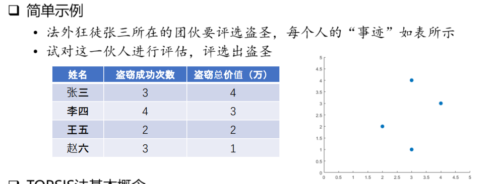
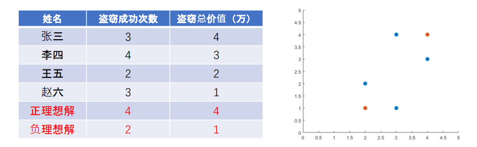
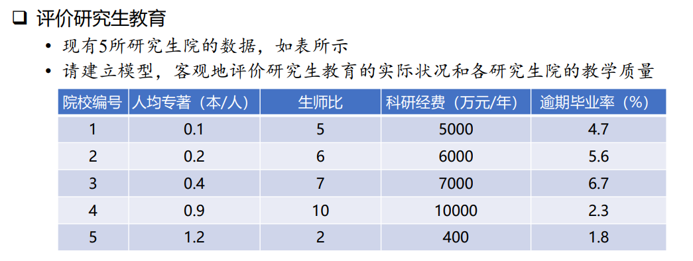
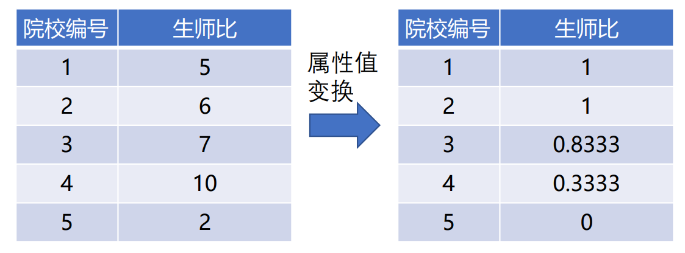
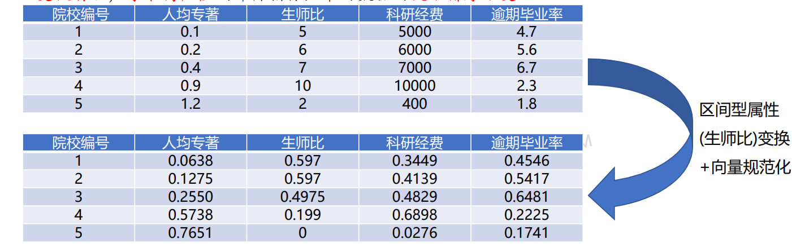
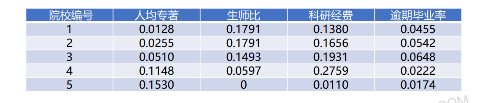
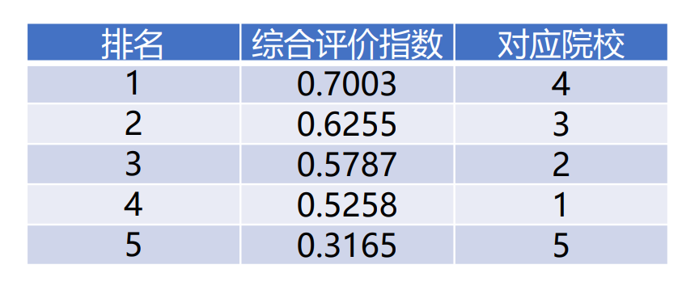

# TOPSIS法（理想解法）
---
## 引例
**请看下面这个简单问题：**

使用 TOPSIS 法，其基本的思想为：
1. 总共 4 人，有 4 中可能的方案，设方案集：$D = \{d_1,d_2,d_3,d_4\}=\{张三，李四，王五，赵六\}$
2. 方案 $d_i$ 的属性值（评价指标）构成**向量** $[a_{i1},a_{i2}]$ ，代表空间中的一个点
3. 集合了两条指标的最优值的点（可能不存在于四个方案中），叫做**正理想解**
4. 集合了两条指标的最差值的点（同样可能不存在于四个方案中），叫做**负理想解**

5. 4 个人中距离正理想解最近，距离负理想解最远的人，就是盗圣

以上就是TOPSIS法的基本思想

## 适用赛题
- 客观评估类型题目
    - 题目提供了**足够的评价指标和数据**
    - 例如：为了客观评价我国研究生教育的实际状况和各研究生院的教学质量，已知各单位的人
    均专著数、师生比、科研经费和逾期毕业率，试进行一次研究生院评估
    - **数据已知，评价指标的类型差异较大**（数值、比值、百分比，且有正面指标也有负面指标）
- 模型特点
    - **充分利用原始数据**，求解结果能反应各方案与理想方案差异程度
    - 在**评价指标较多时**避免了主观性造成的复杂过程
    - 数据计算简单易行，**无需数据检验**
  
## 使用讲解
### 例题
我们通过一个例题来讲解这种方法的使用：

### 问题分析
1. 当前指标数据中，**并不全都是越大越好**
2. **不同指标的单位不同、数量级不同**，使得求点与点距离时对结果影响程度不同，要进行**数据预处理**
### 数据预处理
#### TOPSIS法中规定的三种数据属性
|数据属性|说明|
|:-:|:-:|
|**效益型**属性|**越大越好**的那些指标所具有的属性，例如人均专著、科研经费|
|**成本型**属性|**越小越好**的那些指标所具有的属性，例如逾期毕业率|
|**区间型**属性|**在某一区间内是最好**的那些指标所具有的属性，例如生师比|

#### 不同数据属性对应的数据处理办法
- 效益型属性数据**无需处理**
- 成本型属性数据，**在代码求解时，求正理想解时对其取最小值，求负理想解时对其取最大值**
- 区间型属性数据，根据**数据与最优区间的差异**进行处理，**使其属性转换为效益型属性数据**

#### 区间型属性数据的转换处理
- 确定最优区间和可接受区间
- 在最优区间的那些数据，值直接设为1；超出了可接受区间的那些数据，值直接设为0
- 在最优区间之外，可接受区间之内的那些数据，按照公式映射到 (0,1) 中的值
- 公式如下：
$$
    b_{ij}=\begin{cases}
    1-(a_j^0-a_{ij}) / (a_j^0-a_j') ,& a_j' \le a_{ij} < a_j^0 \\
    1, & a_j^0 \le a_{ij} \le a_j^* \\
    1-(a_{ij}-a_j^*) / (a_j''-a_j^*), & a_j^* < a_{ij} \le a_j'' \\
    0, & else
    \end{cases}
$$
- 公式中，最优区间为 [$a_j^0,a_j^*$]， $a_j'$ 为可接受下限，$a_j''$ 为可接受上限

**经过转换后的生师比数据为：**


#### 效益型和成本型属性数据的归一化
考虑到效益性和成本型数据之间的**数量级差距**，需要进行**归一化**（也称向量规范化），具体操作如下：
1. 求出每列数据的平方之和的二次根号值 b
2. 该列每个数据除以 b，即得到该列数据规范化后的值
3. 具体公式如下：
    $$
        b_{ij} = \frac{a_{ij}}{\sqrt{\sum_{i=1}^{m}{a_{ij}^2}}}
    $$
4. 这样处理，每个评价指标中的数据的大小排序不变

**归一化处理后**的表格如下所示：  


#### 指标数据加权处理
- 为了区别不同指标之间的重要性，对各个指标进行加权处理
- 与层次分析法的两两比较不同，TOPSIS 法**直接**给每个指标加上权重（通过查文献资料确定）
- 因为 TOPSIS 法充分利用了数据的差异，只要权重设置的不是太离谱，对结果的影响不会太大
- 该例题取权重向量为 $w$ = [0.2, 0.3, 0.4, 0.1]，加权处理后的数据如下：



### 数据预处理后最终求解
#### 求解思路
1. 第 $j$ 个指标的正理想解：$c_j^* =$ $\begin{cases}\max c_{ij}, & j 为效益型属性数据 \\ \min c_{ij}, & j为成本型属性数据 \end{cases}$
2. 第 $j$ 个指标的负理想解：$c_j^0 =$ $\begin{cases}\min c_{ij}, & j 为效益型属性数据 \\ \max c_{ij}, & j为成本型属性数据 \end{cases}$
3. 第 $i$ 个方案到正理想解的距离：$s_i^*=\sqrt{\sum_{j=1}^{n}(c_{ij}-c_j^*)^2}$
4. 第 $i$ 个方案到负理想解的距离：$s_i^0=\sqrt{\sum_{j=1}^{n}(c_{ij}-c_j^0)^2}$
5. 各方案的综合评价指数：$f_i^*=\frac{s_i^0}{s_i^0+s_i^*} = \frac{1}{1 + \frac{s_i^*}{s_i^0}}$
6. 按 $f_i^*$ 从大到小排序，则方案的优劣排序即为 $f_i^*$ 的顺序

最终方案的排序如下：


## 代码求解
**上面例题的代码求解如下：**
```python
import numpy as np

# 初始方案——指标矩阵
Apre = np.array([[0.1,5,5000,4.7],[0.2,6,6000,5.6],[0.4,7,7000,6.7],[0.9,10,10000,2.3],[1.2,2,400,1.8]]) 
# print("A: ", Apre)

def func(x):
    return np.piecewise(x,[(2 <= x) & (x < 5), (5 <= x) & (x <= 6), (6 <= x) & (x <= 12), (x < 2) | (x > 12)], [lambda x:1-(5 - x)/ 3, lambda x:1, lambda x:1-(x - 6)/ 6, lambda x:0])

for i in range(5):
    Apre[i, 1] = func(Apre[i, 1])
    
# print(Apre)

# 向量规范化
sumval = []
for i in range(4):
    sumval.append(np.sqrt(sum([x**2 for x in Apre[:,i]])))
    
for i in range(4):
    Apre[: , i] /= sumval[i]
    
# print(Apre)
# 指标加权处理
w = np.array([0.2, 0.3, 0.4, 0.1])
for i in range(4):
    Apre[: , i] *= w[i]
    
# print(Apre)
# 获取正负理想解
Cpos = []
Cneg = []
for i in range(4):
    Cpos.append(max(Apre[: , i]))
    Cneg.append(min(Apre[: , i]))
    
temp = Cpos[3]
Cpos[3] = Cneg[3]
Cneg[3] = temp

# print(Cpos)
# print(Cneg)

distancePos = []
distanceNeg = []
points = []

for i in range(5):
    distancePos.append(np.sqrt(sum([(Apre[i, j]-Cpos[j])**2 for j in range(4)])))
    distanceNeg.append(np.sqrt(sum([(Apre[i, j]-Cneg[j])**2 for j in range(4)])))
    points.append(distanceNeg[i] / (distancePos[i] + distanceNeg[i]))
    
# print(points)
res = {i + 1:points[i] for i in range(len(points))}
# print(res)

# print(res.items())
sortedRes = dict(sorted(res.items(), key=lambda x:x[1], reverse=True))
print("最终的得分结果：", sortedRes)
resList = list(sortedRes.keys())
print("即最终的排序为：", resList)
```
**运行结果：**
```python
最终的得分结果: {4: 0.7002782166246625, 3: 0.6255115354408003, 2: 0.578738724731772, 1: 0.525813800160824, 5: 0.3164914795793433}
即最终的排序为: [4, 3, 2, 1, 5]
```