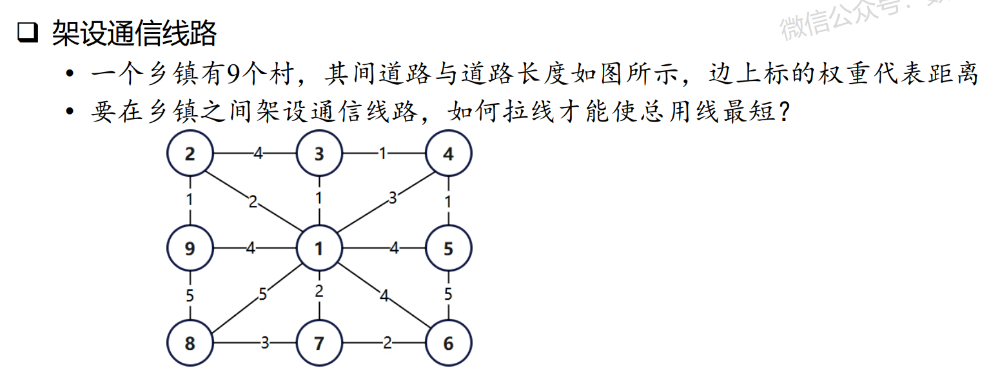

# 最小生成树
---
## 最小生成树概念
### 生成树
- 树是图论中的基本概念。连通的无圈图称为树（Tree），就是**不包含循环的回路的连通图。**

- 对于无向连通图，生成树（Spanning tree）是原图的极小连通子图，它包含原图中的所有 n 个顶点，并且有保持图连通的最少的边，即只有足以构成一棵树的 n-1 条边。

- 生成树满足：
    1. 包含连通图中所有的顶点；
    2. 任意两顶点之间有且仅有一条通路。因此，生成树中边的数量 = 顶点数 - 1。

- 对于非连通无向图， 遍历每个连通分量中的顶点集合所经过的边是多颗生成树，这些连通分量的生成树构成非连通图的生成森林。

### 最小生成树和最大生成树
- 遍历连通图的方式通常有很多种，也就是说**一张连通图可能有多种不同的生成树。**

- 无向赋权图的生成树中，各条边的权重之和最小的生成树，称为最小生成树（minimum spanning tree，MST），也称最小权重生成树。

- 对应地，各条边的权重之和最大的生成树，称为最大生成树（maximum spanning tree）。

### 最小生成树问题
- 最小生成树（MST）是图论中的基本问题，具有广泛的实际应用，在数学建模中也经常出现。
  
- **例如，**在若干城市之间铺设通信线路，使任意两个城市之间都可以通信，要使铺设线路的总费用最低，就需要找到最小生成树。类似地，**路线设计、道路规划、官网布局、公交路线、网络设计**，都可以转化为最小生成树问题，如要求总线路长度最短、材料最少、成本最低、耗时最小等。

- 在实际应用中，不仅要考虑网络连通，还要考虑连通网络的质量和效率，就形成了带有约束条件的最小生成树：
    1. **直径限制最小生成树（Bounded diameter minimum spanning tree）**：对给定的连通图，满足直径限制的生成树中，具有最小权的树，称为直径限制最小生成树。直径限制最小生成树问题在资源优化问题中应用广泛，如网络设计的网络直径影响到网络的传输速度、效率和能耗。
    2. **度限制最小生成树（Degree constrained minimum spanning tree）**：对给定的连通图，满足某个节点或全部节点的度约束（如入度不超过 k）的生成树中，具有最小权的树，称为度限制最小生成树。实际应用中，为了控制节点故障对整个系统的影响，需要对节点的度进行限制。

## 最小生成树算法
- 构造最小生成树的算法很多，通常是**从空树开始，按照贪心法逐步选择并加入 n-1 条安全边**（不产生回路），最终得到最小生成树。
- 最小生成树的典型算法有**普里姆算法（Prim算法）和克鲁斯卡算法（Kruskal算法）**。
### 普里姆算法（Prim算法）
- Prim 算法**以顶点为基础**构造最小生成树，**每个顶点只与连通图连接一次**，因此不用考虑在加入顶点的过程中是否会形成回路。

- 算法从某一个顶点 s 开始，每次**选择剩余的代价最小的边所对应的顶点**，加入到最小生成树的顶点集合中，逐步扩充直到包含整个连通网的所有顶点，可以称为“加点法”。

- Prim 算法中图的存贮结构采用**邻接矩阵**，使用一个顶点集合 u 构造最小生成树。由于不断向集合 u 中加点，还需要建立一个**辅助数组**来同步更新最小代价边的信息。

- Prim 算法每次选择顶点时，都需要进行**排序**，但每次都只需要对一部分边进行排序。Prim 算法的时间复杂度为 $O(n*n)$，与边的数量无关，**适用于边很多的稠密图。**

- 采用**堆实现**优先队列来维护最小点，可以将Prim算法的时间复杂度降低到 $O(mlogn)$，称为 Prim_heap 算法，但该算法的**空间消耗很大。**

### 克鲁斯卡算法（Kruskal算法）
- Kruskal 算法**以边为基础**构造最小生成树，利用**避圈**思想，每次找到**不使图构成回路的代价最小的边。**

- 算法初始边数为 0，每次选择一条满足条件的**最小代价边**，加入到**边集合**中，逐步扩充直到包含整个生成树，可以称为“加边法”。

- Kruskal 算法中图的存贮结构采用**边集数组**，权值相等的边在数组中的排列次序是任意的。Kruskal 算法开始就要对所有的边进行**排序**，之后还需要对所有边应用 Union-Find 算法，但不再需要排序。

- Kruskal 算法的时间复杂度为 $O(mlogm)$，主要是对边排序的时间复杂度，适用于**边较少的稀疏图。**

## NetworkX 的最小生成树算法
### NetworkX 的最小/最大生成树函数
|函数|说明|
|:-:|:-:|
|minimum_spanning_tree(G[, weight,…])|计算无向图上的最小生成树|
|maximum_spanning_tree(G[, weight,…])|计算无向图上的最大生成树|
|minimum_spanning_edges(G[, algorithm,…])|计算无向加权图最小生成树的边|
|maximum_spanning_edges(G[, algorithm,…])|计算无向加权图最大生成树的边|
### 简单使用说明
```python
minimum_spanning_tree(G, weight=‘weight’, algorithm=‘kruskal’, ignore_nan=False)

minimum_spanning_edges(G, algorithm=‘kruskal’, weight=‘weight’, keys=True, data=True, ignore_nan=False)
```
minimum_spanning_tree() 用于计算无向连通图的最小生成树（森林）。
minimum_spanning_edges() 用于计算无向连通图的最小生成树（森林）的边。
对于连通无向图，计算最小生成树；对于非连通无向图，计算最小生成森林。

**主要参数：**
|参数|说明|
|:-:|:-:|
|G(undirected graph)|无向图|
|weight(str)|指定用作计算权重的边属性|
|algorithm(string)|计算最小生成树的算法，可选项为 ‘kruskal’、‘prim’ 或 ‘boruvka’。默认算法为 ‘kruskal’|
|data(bool)|指定返回值是否包括边的权值|
|ignore_nan(bool)|是否在边的权重为 Nan 时产生异常|

**返回值：**
|返回值|说明|
|:-:|:-:|
|minimum_spanning_tree()|返回由最小生成树构成的图，类型为 NetworkX Graph，需要用 T.edges() 获得对应的最小生成树的边|
|minimum_spanning_edges()|返回最小生成树的构成边，类型为<class ‘generator’>，需要用 list() 转换为列表数据|

**附：上述内容参考自**[Python小白的数学建模课-18.最小生成树问题](https://blog.csdn.net/youcans/article/details/118566422?ops_request_misc=%257B%2522request%255Fid%2522%253A%2522170522314816800192268322%2522%252C%2522scm%2522%253A%252220140713.130102334.pc%255Fblog.%2522%257D&request_id=170522314816800192268322&biz_id=0&utm_medium=distribute.pc_search_result.none-task-blog-2~blog~first_rank_ecpm_v1~rank_v31_ecpm-4-118566422-null-null.nonecase&utm_term=Python%E5%B0%8F%E7%99%BD%E7%9A%84%E6%95%B0%E5%AD%A6%E5%BB%BA%E6%A8%A1%E8%AF%BE&spm=1018.2226.3001.4450)

## 适用赛题
- 通信建设、管道铺设规划
    - 已知有 X 个城市，其相互之间的路径距离已知
    - 要求以最小的成本建设通信线路或铺设管道，使得城市之间能够相互连通
    - 对应**图论**，重点在于所有**顶点两两之间都存在路径（连通）**，且总路径（权重之和）最小
- 基本特点
    - 最小生成树是一个连通图，即任意两点间都存在相互到达的路径
    - 最小生成树是从**全局角度**考虑，使两两之间连通且总路径最短，**没有起点和终点的概念**
    - **最短路径**是针对指定**源点（起点）和指定终点**，求两点间最短路径
    - **究竟是考虑全局最短，还是指定的起点与终点最短，是两者的根本区别**

## 典型例题与解答
**例题如下：**
- 一个乡镇有9个村，其间道路与道路长度如图所示，边上标的权重代表距离
- 要在乡镇之间架设通信线路，如何拉线才能使总用线最短？


---
**代码求解：**
```python
import networkx as nx

G = nx.Graph()
G.add_weighted_edges_from([(1,2,2), (1,3,1),(1,4,3),(1,5,4),
(1,6,4),(1,7,2),(1,8,5),(1,9,4),(2,3,4),(2,9,1),(3,4,1),
(4,5,1),(5,6,5),(6,7,2),(7,8,3),(8,9,5)])

T = nx.minimum_spanning_tree(G)
print(T.nodes)
print(T.edges)
print(sorted(T.edges(data=True)))
sum = 0
for edge in T.edges(data=True):
    sum += edge[2]['weight']
    
print('sum =', sum)

# TE = nx.tree.minimum_spanning_edges(G, algorithm='kruskal')
# print(list(TE))
```
**运行结果：**
```python
[1, 2, 3, 4, 5, 6, 7, 8, 9]
[(1, 3), (1, 2), (1, 7), (2, 9), (3, 4), (4, 5), (6, 7), (7, 8)]
[(1, 2, {'weight': 2}), (1, 3, {'weight': 1}), (1, 7, {'weight': 2}), (2, 9, {'weight': 1}), (3, 4, {'weight': 1}), (4, 5, {'weight': 1}), (6, 7, {'weight': 2}), (7, 8, {'weight': 3})]
sum = 13
```