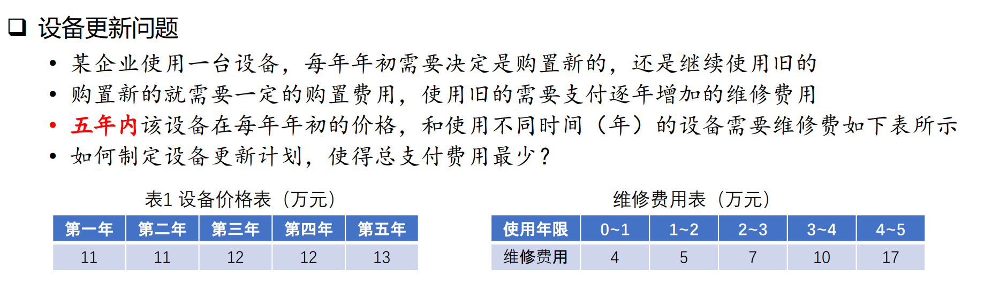

# 单源最短路径
---
## 最短路径问题
- 最短路径问题是图论研究中的经典算法问题，用于计算图中一个顶点到另一个顶点的最短路径。
- 最短路径问题有几种形式：
    1. 确定起点的最短路径
    2. 确定终点的最短路径
    3. 确定起点和终点的最短路径
    4. 全局最短路径问题
### 最短路径长度与最短路径距离
- 最短路径长度：从 A 到 B 所走的最短的步数，**与权重无关**（或者说每一步的权重都是 1）
- 最短路径举例：从 A 到 B 所走的**加权最短路径**，即 A 到 B 的最小权重和路径
### 最短路径常用算法
#### Dijkstra 算法
- Dijkstra 算法是**经典的最短路径算法**，在数据结构、图论、运筹学中都是教学的基本算法
- Dijkstra 算法从起点开始，采用**贪心法策略**，每次遍历距离起点最近且未访问过的邻接顶点，层层扩展直到终点为止
- Dijkstra 算法可以求出**加权最短路径的最优解**，算法的时间复杂度为 $O(n^2)$。如果边数远小于 $n^2$，可以用堆结构将复杂度降为$O((m+n)log(n))$
- Dijkstra 算法**不能处理负权边**，这是由贪心法的选择规则决定的
#### Bellman-Ford 算法
- Bellman-Ford 算法是求**含负权图**的**单源最短路径算法**。算法原理是对图进行 V-1 次**松弛**操作，得到所有可能的最短路径
- Bellman-Ford 算法可以处理负权边。其基本操作 “拓展” 是在深度上搜索，而 “松弛” 操作则在广度上搜索，因此可以对负权边进行操作而不影响结果
- Bellman-Ford 算法的**效率很低**，时间复杂度高达 $O(V*E)$，V、E 分别是顶点和边的数量。SPFA 是 Bellman-Ford 的队列优化，通过维护一个队列极大地减少了重复计算，时间复杂度为 $O(k*E)$
- Dijkstra 算法在求解过程中，起点到各顶点的最短路径求出后就不变了。Bellman 算法在求解过程中，每次循环都要修改所有顶点间的距离，起点到各顶点最短路径一直要到算法结束才确定
#### Floyd 算法
- Floyd 算法又称插点法，运用**动态规划**思想求解有权图中多源点之间最短路径问题。算法从图的带权邻接矩阵开始，递归地进行 n 次更新得到图的距离矩阵，进而可以得到最短路径节点矩阵
- Floyd 算法的时间复杂度为 $O(n^3)$，空间复杂度为 $O(n^2)$。算法时间复杂度较高，**不适合计算大量数据**。Floyd 算法的优点是可以一次性求解任意两个节点之间的最短距离，对于**稠密图**的效率高于执行 V 次 Dijkstra 算法
- Floyd 算法可以处理负权边。
#### A* 算法
- A* 算法是一种静态路网中求解最短路径最有效的直接搜索方法
- A* 算法是启发式算法，采用最佳优先（Best-first）搜索策略，基于估价函数对每个搜索位置的评估结果，猜测最好的位置优先进行搜索。
- A* 算法极大地减少了低质量的搜索路径，因而**搜索效率很高**，比传统的路径规划算法**实时性更高、灵活性更强**；但是，A* 算法找到的是**相对**最优路径，不是绝对的最短路径，适合**大规模、实时性高**的问题。
### 最短路径算法的选择
1. 需要求解任意两个节点之间的最短距离，使用 Floyd 算法；
2. 只要求解单源最短路径问题，有负权边时使用 Bellman-Ford 算法，没有负权边时使用 Dijkstra 算法；
3. A*算法找到的是相对最优路径，适合大规模、实时性高的问题。

## 最短路径问题基于 NetworkX 库的求解
NetworkX 提供了丰富的最短路径函数，除了常见的 **Dijkstra 算法、Bellman-ford 算法、Floyd Warshall 算法和 A*算法**，还有 Goldbery-Radzik 算法和 Johnson 算法。其中，Bellman-ford 算法函数使用的是队列改进算法，即以 **SPFA** 算法实现。
### 无向图和有向图的最短路径求解函数
**函数一览：**
|函数|功能|
|:-:|:-:|
|shortest_path(G[, source, target, weight, ...])|计算图中的最短路径|
|all_shortest_paths(G, source, target[,...])|计算图中所有最短的简单路径|
|shortest_path_length(G[, source, target, ...])|计算图中的最短路径长度|
|average_shortest_path_length(G[, weight, method])|计算平均最短路径长度|

其中，最基本的求解最短路径函数 **shortest_path()** 和 最短路径长度 **shortest_path_length()** 是 **‘dijkstra’ 算法和 ‘bellman-ford’ 算法的集成接口**，可以通过 **method=‘xxx’** 选择不同的算法。
**主要参数：**
|参数|说明|
|:-:|:-:|
|G(NetworkX graph)|图|
|source (node)|起点|
|target (node)|终点|
|weight (string or function)|参数为字符串(string)时，按该字符串查找边的**属性**作为权重；如果该字符串对应的边属性不存在，则权重**置为 1**；参数为函数时，边的权重是**函数的返回值**|
|method [string, optional (default = ‘dijkstra’)]|支持的选项为 **‘dijkstra’, ‘bellman-ford’**|
### 无权图最短路径算法   
**函数一览：**
|函数|说明|
|:-:|:-:|
|single_source_shortest_path(G, source[,cutoff])|计算从源到所有可达节点的最短路径|
|single_source_shortest_path_length(G,source)|计算从源到所有可达节点的最短路径长度|
|single_target_shortest_path(G, target[,cutoff])|计算从所有可达节点到目标的最短路径|
|single_target_shortest_path_length(G,target)|计算从所有可达节点到目标的最短路径长度|
|all_pairs_shortest_path(G[, cutoff])|计算所有节点之间的最短路径|
|all_pairs_shortest_path_length(G[, cutoff])|计算所有节点之间的最短路径长度|  
### 有权图最短路径算法
**函数一览：**
|函数|说明|   
|:-:|:-:|
|dijkstra_path(G, source, target[, weight])	|计算从源到目标的最短加权路径|
|dijkstra_path_length(G, source, target[,weight])|计算从源到目标的最短加权路径长度|
|all_pairs_dijkstra_path(G[, cutoff, weight])|计算所有节点之间的最短加权路径|
|all_pairs_dijkstra_path_length(G[, cutoff,… ])|计算所有节点之间的最短加权路径长度|
|bellman_ford_path(G, source, target[, weight])|计算从源到目标的最短路径|
|bellman_ford_path_length(G, source, target)|计算从源到目标的最短路径长度|
|all_pairs_bellman_ford_path(G[, weight])|计算所有节点之间的最短路径|
|all_pairs_bellman_ford_path_length(G[,weight])|计算所有节点之间的最短路径长度|
|floyd_warshall(G[, weight])|用 Floyd 法计算所有节点之间的最短路径长度|
|floyd_warshall_numpy(G[, nodelist, weight])|用 Floyd 法计算所有指定节点之间的最短路径长度|
## NetworkX 中的 Dijkstra 算法
NetworkX 中关于 Dijkstra 算法提供了 13 个函数，很多函数的功能是重复的。这里只介绍最基本的函数 dijkstra_path() 和 dijkstra_path_length()。
### dijkstra_path() 和 dijkstra_path_length() 使用说明
dijkstra_path() 用于计算从源到目标的最短加权路径，dijkstra_path_length() 用于计算从源到目标的最短加权路径长度。
```python
dijkstra_path(G, source, target, weight=‘weight’)
dijkstra_path_length(G, source, target, weight=‘weight’)
```
**主要参数：**
|参数|说明|
|:-:|:-:|
|G(NetworkX graph)|图|
|source (node)|起点|
|target(node)|终点|
|weight (string or function)|参数为字符串(string)时，按该字符串查找边的**属性**作为权重；如果该字符串对应的边属性不存在，则权重**置为 1**；参数为函数时，边的权重是**函数的返回值**|

**返回值：**
|返回值|说明|
|:-:|:-:|
|dijkstra_path()|返回最短加权路径中的**节点列表**，**数据类型为list**|
|dijkstra_path_length()|返回最短加权路径的**长度**（路径中的边的权重之和）|

**案例程序：**
```python
# Demo of shortest path with NetworkX

import matplotlib.pyplot as plt # 导入 Matplotlib 工具包
import networkx as nx  # 导入 NetworkX 工具包

# 问题 1：无向图的最短路问题（司守奎，数学建模算法与应用，P43，例4.3）
G1 = nx.Graph()  # 创建：空的 无向图
G1.add_weighted_edges_from([(1,2,2),(1,3,8),(1,4,1),
                            (2,3,6),(2,5,1),
                            (3,4,7),(3,5,5),(3,6,1),(3,7,2),
                            (4,7,9),
                            (5,6,3),(5,8,2),(5,9,9),
                            (6,7,4),(6,9,6),
                            (7,9,3),(7,10,1),
                            (8,9,7),(8,11,9),
                            (9,10,1),(9,11,2),
                            (10,11,4)])  # 向图中添加多条赋权边: (node1,node2,weight)
print('nx.info:',G1.nodes)  # 返回图的基本信息

# 两个指定顶点之间的最短加权路径
minWPath_v1_v11 = nx.dijkstra_path(G1, source=1, target=11)  # 顶点 1 到 顶点 11 的最短加权路径
print("顶点 v1 到 顶点 v11 的最短加权路径: ", minWPath_v1_v11)
# 两个指定顶点之间的最短加权路径的长度
lMinWPath_v1_v11 = nx.dijkstra_path_length(G1, source=1, target=11)  # 最短加权路径长度
print("顶点 v1 到 顶点 v11 的最短加权路径长度: ", lMinWPath_v1_v11)

pos = {1: (0,4), 2: (5,7), 3: (5,4), 4: (5,1), 5: (10,7), 6: (10,4), 7: (10,1),
       8: (15,7), 9: (15,4), 10: (15,1), 11: (20,4)}  # 指定顶点位置
labels = nx.get_edge_attributes(G1, 'weight')  # 设置边的 labels 为 ‘weight'
nx.draw(G1, pos, with_labels=True, font_color='w')  # 绘制无向图
nx.draw_networkx_edge_labels(G1, pos, edge_labels=labels, font_color='c')  # 显示边的权值
plt.show()
```
**运行结果：**
```python
nx.info: [1, 2, 3, 4, 5, 6, 7, 8, 9, 10, 11]
顶点 v1 到 顶点 v11 的最短加权路径:  [1, 2, 5, 6, 3, 7, 10, 9, 11]
顶点 v1 到 顶点 v11 的最短加权路径长度:  13
```

##  NetworkX 中的 Bellman-Ford 算法
### bellman_ford_path() 和 bellman_ford_path_length() 使用说明
bellman_ford_path() 用于计算从源到目标的最短加权路径，bellman_ford_path_length() 用于计算从源到目标的最短加权路径长度。
```python
bellman_ford_path(G, source, target, weight=‘weight’)
bellman_ford_path_length(G, source, target, weight=‘weight’)
```
**主要参数：**
|参数|说明|
|:-:|:-:| 
|G(NetworkX graph)|图|
|source (node)|起点|
|target(node)|终点|
|**weight (string)**| 按字符串查找边的**属性**作为权重，默认值为'weight'|

**返回值：**
|返回值|说明|
|:-:|:-:|
|bellman_ford_path()|返回最短加权路径中的节点列表，数据类型为list|
|bellman_ford_path_length()|返回最短加权路径的长度（路径中的边的权重之和）|

**案例程序：**
```python
# Demo of shortest path with NetworkX

import pandas as pd
import matplotlib.pyplot as plt # 导入 Matplotlib 工具包
import networkx as nx  # 导入 NetworkX 工具包

# 问题 2：城市间机票价格问题（司守奎，数学建模算法与应用，P41，例4.1）
# # 从Pandas数据格式（顶点邻接矩阵）创建 NetworkX 图
# # from_pandas_adjacency(df, create_using=None) # 邻接矩阵，n行*n列，矩阵数据表示权重
dfAdj = pd.DataFrame([[0, 50, 0, 40, 25, 10],  # 0 表示不邻接，
                      [50, 0, 15, 20, 0, 25],
                      [0, 15, 0, 10, 20, 0],
                      [40, 20, 10, 0, 10, 25],
                      [25, 0, 20, 10, 0 ,55],
                      [10, 25, 0, 25, 55, 0]])
G2 = nx.from_pandas_adjacency(dfAdj)  # 由 pandas 顶点邻接矩阵 创建 NetworkX 图

# 计算最短路径：注意最短路径与最短加权路径的不同
# 两个指定顶点之间的最短路径
minPath03 = nx.shortest_path(G2, source=0, target=3)  # 顶点 0 到 顶点 3 的最短路径
lMinPath03 = nx.shortest_path_length(G2, source=0, target=3)  #最短路径长度
print("顶点 0 到 3 的最短路径为：{}，最短路径长度为：{}".format(minPath03, lMinPath03))
# 两个指定顶点之间的最短加权路径
minWPath03 = nx.bellman_ford_path(G2, source=0, target=3)  # 顶点 0 到 顶点 3 的最短加权路径
# 两个指定顶点之间的最短加权路径的长度
lMinWPath03 = nx.bellman_ford_path_length(G2, source=0, target=3)  #最短加权路径长度
print("顶点 0 到 3 的最短加权路径为：{}，最短加权路径长度为：{}".format(minWPath03, lMinWPath03))

for i in range(1,6):
    minWPath0 = nx.bellman_ford_path(G2, source=0, target=i)  # 顶点 0 到其它顶点的最短加权路径
    lMinPath0 = nx.bellman_ford_path_length(G2, source=0, target=i)  #最短加权路径长度
    print("城市 0 到 城市 {} 机票票价最低的路线为: {}，票价总和为：{}".format(i, minWPath0, lMinPath0))

nx.draw_shell(G2, with_labels=True, node_color='r', edge_color='b', font_color='w', width=2)
plt.show()
```
**注：使用邻接矩阵创建出的图的顶点默认为 0 到 n-1**

**运行结果：**
```python
顶点 0 到 3 的最短路径为：[0, 3]，最短路径长度为：1
顶点 0 到 3 的最短加权路径为：[0, 4, 3]，最短加权路径长度为：35
城市 0 到 城市 1 机票票价最低的路线为: [0, 5, 1]，票价总和为：35
城市 0 到 城市 2 机票票价最低的路线为: [0, 4, 2]，票价总和为：45
城市 0 到 城市 3 机票票价最低的路线为: [0, 5, 3]，票价总和为：35
城市 0 到 城市 4 机票票价最低的路线为: [0, 4]，票价总和为：25
城市 0 到 城市 5 机票票价最低的路线为: [0, 5]，票价总和为：10
```
---
附：内容参考自[Python小白的数学建模课-16.最短路径算法](https://blog.csdn.net/youcans/article/details/118555468)

## 适用赛题
- 货物运输类问题
    - 公路运输/铁路运输的路线固定，距离已知，每条路径耗费的费用已知
    - 设计从**某点出发**，到达**终点**的运输路径，使总费用/路径最小
- 设备更新问题
    - 购置新设备需要一笔费用，继续使用旧设备也需要支付维修费用且逐年增大
    - 在**一定年限**内，如何安排购置新设备和使用旧设备，使总支付费用最小
- 典型特征
    - **从某个 “起点” 到某个 “终点”**，即始终围绕 “起点到终点” 的 “总路径” 求最优
    - 这一点可以在看完最小生成树后思考两者的区别和联系
- 注意事项
    - 图论解决的问题大部分是求最优解，**常常与规划类模型结合**
    - 一般涉及已知点到点之间的路径/费用等，**能作出图，即可用图论的算法求解**

## 典型例题
**题目如下：**

### 题目分析
- 关键在于制定计划使 “**五年内**总支付费用最少”
- 从单源最短路径模型思考：从第1年初起，到第5年末，中间有很多选择（每一年是买新的还是用旧的）
- **第1年初 = 源点，第5年末 = 终点，每年的选择 = 路径，总支付费用 = 总路径**
### 模型建立
- 构造有向图 D，包括顶点$V=\{v_1,v_2,...,v_6\}$，分别代表第 1 年年初、第 2 年年初、......、第 5 年年初、第 5 年年末
- 顶点之间的有向边$v_i$ -> $v_j$代表 "$i$ 时刻购买新设备，使用到 $j$ 时刻"，该边的权重代表两个时刻之间购买新设备的费用与维修费用之和
- 画出该图，并写出该图的邻接矩阵 $W$
    $$
        W = 
        \begin{bmatrix}
        0 & 15 & 20 & 27 & 37 & 54 \\
        \infty & 0 & 15 & 20 & 27 &37\\
        \infty & \infty & 0 & 16 & 21 & 28\\
        \infty & \infty & \infty & 0 & 16 & 21\\
        \infty & \infty & \infty & \infty & 0 & 17\\
        \infty & \infty & \infty & \infty & \infty & 0\\
        \end{bmatrix}
    $$

- 随后只需将该邻接矩阵在 python 中表示出来，调用函数求解即可
- 注：$\infty$ 在代码中均表示为 0，在这里同时出现 $\infty$ 和 0 仅仅是为了区分不存在边和自己到自己的边。
### 代码
代码如下：
```python
import networkx as nx
import pandas as pd
import numpy as np

matrix = pd.DataFrame([[0, 15, 20, 27, 37, 54],
                       [0, 0, 15, 20, 27, 37],
                       [0, 0, 0, 16, 21, 28],
                       [0, 0, 0, 0, 16, 21],
                       [0, 0, 0, 0, 0, 0, 17],
                       [0, 0, 0, 0, 0, 0]])

G = nx.from_pandas_adjacency(matrix)

bestPath_v1_v6 = nx.dijkstra_path(G, source=0, target=5)
bestPathLength_v1_v6 = nx.dijkstra_path_length(G, source=0, target=5)

for i in range(len(bestPath_v1_v6)) :
    bestPath_v1_v6[i] += 1

print("最短路径为：", bestPath_v1_v6)
print("最短路径下的长度为：", bestPathLength_v1_v6)
```  
**运行结果：**
```python
最短路径为： [1, 3, 6]
最短路径下的长度为： 48
```
**结果分析：**
1. 第 1 年年初购买新设备
2. 使用到第 3 年年初，再购买新设备
3. 使用到第 5 年年末
4. 如此能使 5 年内总支付费用最少，最少为 48 万