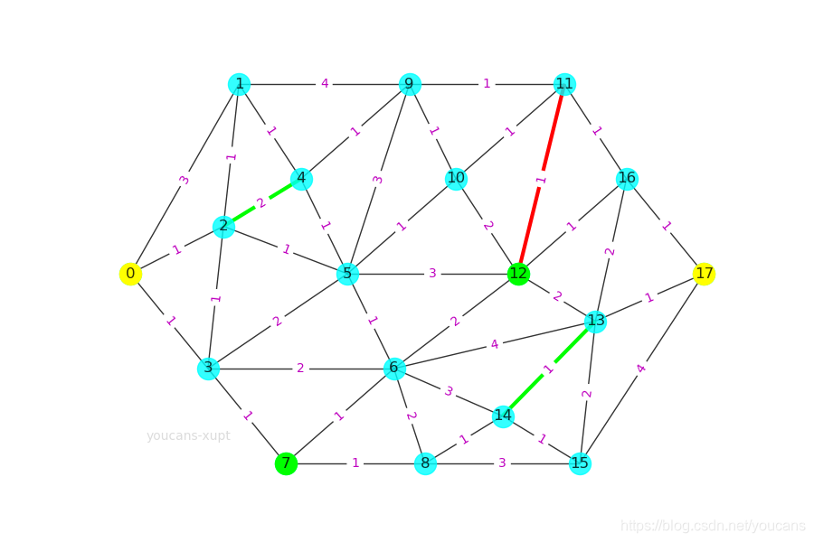
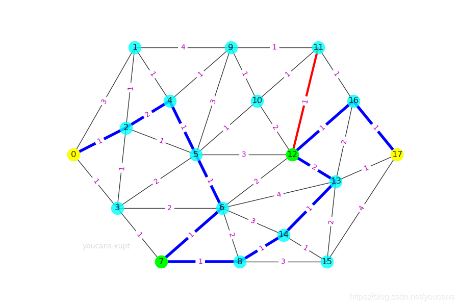

# 条件最短单源路径
---
## 带有条件约束的最短路径问题——引入
- 条件最短路径问题，指**带有约束条件、限制条件的最短路径问题**。例如： 
    1. **顶点约束**，包括**必经点或禁止点**的限制； 
    2. **边的约束**，包括**必经路段、禁行路段和单向路段；**
    3. **无权路径长度**的限制，如要求经过几步或不超过几步到达终点。
- 进一步的，还有**双目标限制的最短路径问题**，求最短长度中花费最小的路线；交通限制条件下的最短路径问题，如转向限制、道路交叉口的时间延误的约束。
- 求解带有限制条件的最短路径问题，总体来说可以分为**两类基本方法：**
    1. 一类是基于不带限制条件的最短路径算法，**对求解过程中的每一条有效路径，都用限制条件进行判断**，如果满足所有限制条件则继续，如果不满足限制条件则放弃该路径；
    2. 另一类方法是基于具体问题和选择算法的特点，**将问题转化为有约束的规划问题来处理。**
- **但是**，如果使用 NetworkX 求解带有限制条件的最短路径问题，采用这两类方法都会有一些**困难**。
    1. 原因在于前文所介绍的 NetworkX 提供的 Dijkstra 算法、Bellman-Ford 算法、Floyd 算法和启发式算法 A* 都是封装函数，没有提供设置约束条件的选项和接口，因此用户不能把条件判断语句加入这些封装函数的程序内部。
    2. 这个问题不仅存在于 Python 语言的 NetworkX 工具包，对于其它计算机语言的工具包也是类似的。自己编程序费时费力，但可以根据需要修改和扩展；直接调用工具包的算法函数非常方便，但不能进行修改或扩展。
- **不过**，NetworkX 可以生成两个顶点之间的所有简单路径，而且可以获得所有简单路径的边的列表。利用简单路径算法，**可以通过对约束条件的判断来求解带有顶点约束和边约束的最短路径问题。**

## 使用 NetworkX 求解条件最短路径问题

### 无限制条件的最短路径
之前已经介绍过，不再赘述

### 限制条件：禁止点或禁止边
1. 禁止点或者禁止边的处理比较简单，从图中**删除对应的禁止顶点或禁止边即可**。当然，也可以在创建图时就不添加这些禁止点和禁止边，但这会导致绘图时也无法反映这些顶点和边。
2. 使用 **remove_node(n)** 删除指定顶点 n，**remove_edge(u, v)** 删除指定的边 (u, v)。
3. 使用 **remove_nodes_from([n1, ...nk])** 删除多个顶点，**remove_edges_from([(u1, v1), ...(uk,vk)])** 删除多条边。
4. 
### 限制条件：一个必经点
1. 当限制条件为一个必经点时，可以把原问题分解为两个子问题：
   1. 子问题 1 : 起点至必经点，
   2. 子问题 2 : 必经点至终点。
2. 对两个子问题**分别求其最短加权路径和最短加权路径长度**，然后将两个子问题的**结果合并**，就得到经过必经点的**原问题的最短加权路径和最短加权路径长度。**

### 限制条件：多个必经点
1. 当限制条件为两个或多个必经点，如果指定这些必经点的**先后顺序**，可以按 “一个必经点” 的方法将原问题分解为**多个**子问题。
2. 如果不指定这些比较点的先后顺序， 从起点出发不知道应该先去哪个必经点，这时有两种处理方法：
   1. 一是用**穷举法**对所有可能的**顺序**都进行计算，然后进行**比较；**
   2. 二是通过**约束条件**对所有简单路径进行**判断**。
   3. NetworkX 提供了 **all_simple_paths()** 函数，可以生成两个顶点之间的所有简单路径。利用简单路径算法，可以通过**对约束条件的判断**来求解带有多个顶点约束的最短路径问题。步骤包括：
      1. 生成指定起点、终点的**所有简单路径；**
      2. 判断路径是否满足**包括所有必经点**的限制条件；
      3. 在满足限制条件的简单路径中找**加权长度最短**的路径；
      4. 求最短路径的加权路径长度。
3. **核心代码（示例）：**
```python
for path in nx.all_simple_paths(gAntS, 0, 17):  # 所有起点为0、终点为17的简单路径
    if all(n in path for n in (2,4,7,12,13,14)):
```
### 限制条件：必经边
1. 延续处理多个必经点的思路，生成两个顶点之间的所有简单路径，通过**对必经边约束条件的判断**来求解必经边约束最短路径问题。
2. **核心代码（示例）：**
```python
# 检查 (N2,N4)
p1 = path.index(2)  # N2 的位置
if (path[p1-1]!=4 and path[p1+1]!=4): continue  # 判断 N2~N4 是否相邻
# 检查 (N13,N14)
p2 = path.index(13)  # # N13 的位置
if (path[p2-1]!=14 and path[p2+1]!=14): continue  # 判断 N13~N14 是否相邻
```
### 典型例题及其求解
#### 例题题干
蚁巢有若干个储藏间（图中圆圈所示），储藏间之间有路径相连（路径拓扑结构如图所示）。
该图为无向图，路径通行的花费如图中线路上的数字所示，路径正反方向通行的花费相同。
要求从起点 N0 到终点 N17 的最优路径，并需要满足条件：
1. 必须经过图中的绿色节点 N7、N12；
2. 必须经过图中的两段绿色路段 (N2, N4)、(N13, N14)；
3. 必须避开图中的红色路段 (N11, N12)；
4. 求花费最少的最优路径。

#### 求解
**代码：**
```python
# Demo of shortest path with constraints with NetworkX

import numpy as np
import matplotlib.pyplot as plt # 导入 Matplotlib 工具包
import networkx as nx  # 导入 NetworkX 工具包

# 问题：蚂蚁的最优路径分析（西安邮电大学第12届数学建模竞赛B题）
gAnt = nx.Graph()  # 创建：空的 无向图
gAnt.add_weighted_edges_from([(0,1,3),(0,2,1),(0,3,1),
                            (1,2,1),(1,4,1),(1,9,4),
                            (2,3,1),(2,4,2),(2,5,1),
                            (3,5,2),(3,6,2),(3,7,1),
                            (4,5,1),(4,9,1),
                            (5,6,1),(5,9,3),(5,10,1),(5,12,3),
                            (6,7,1),(6,8,2),(6,12,2),(6,13,4),(6,14,3),
                            (7,8,1),
                            (8,14,1),(8,15,3),
                            (9,10,1),(9,11,1),
                            (10,11,1),(10,12,2),
                            (11,12,1),(11,16,1),
                            (12,13,2),(12,16,1),
                            (13,14,1),(13,15,2),(13,16,2),(13,17,1),
                            (14,15,1),
                            (15,17,4),
                            (16,17,1)])  # 向图中添加多条赋权边: (node1,node2,weight)

pos={0:(0,8),1:(7,12),2:(6,9),3:(5,6),4:(11,10),5:(14,8),  # 指定顶点位置
     6:(17,6),7:(10,4),8:(19,4),9:(18,12),10:(21,10),11:(28,12),
     12:(25,8),13:(30,7),14:(24,5),15:(29,4),16:(32,10),17:(37,8)}

fig, ax = plt.subplots(figsize=(9, 6))
nx.draw(gAnt, pos, with_labels=True, node_color='cyan', alpha=0.8)
labels = nx.get_edge_attributes(gAnt,'weight')  # 边的权值
nx.draw_networkx_edge_labels(gAnt,pos,edge_labels=labels, font_color='m')  # 显示边的权值
nx.draw_networkx_nodes(gAnt,pos,nodelist=[0,17],node_color='yellow')  # 设置顶点颜色：N1,N17
nx.draw_networkx_nodes(gAnt,pos,nodelist=[7,12],node_color='lime')  # 设置顶点颜色：N7,N12
nx.draw_networkx_edges(gAnt,pos,edgelist=[(2,4),(13,14)],edge_color='lime',width=3)  # 设置指定边的颜色、宽度
nx.draw_networkx_edges(gAnt,pos,edgelist=[(11,12)],edge_color='r',width=3)  # 设置指定边的颜色、宽度

# 7. 限制条件：必经点 N7,N12，必经边 (N2,N4), (N13,N14)，禁止边 (11,12)
# 解决方案：遍历从起点到终点的简单路径，求满足必经边条件的最短路径
gAntS = gAnt.copy()
gAntS.remove_edge(11,12)  # 删除禁止边 (11,12)
lMinWPath = minWPath = 1e9  # 置初值
for path in nx.all_simple_paths(gAntS, 0, 17):  # 所有起点为0、终点为17的简单路径
    if all(n in path for n in (2,4,7,12,13,14)): # 满足路径中包括顶点 N7,N12
        # 检查 (N2,N4)
        p1 = path.index(2)  # N2 的位置
        if (path[p1-1]!=4 and path[p1+1]!=4): continue  # 判断 N2~N4 是否相邻
        # 检查 (N13,N14)
        p2 = path.index(13)  # # N13 的位置
        if (path[p2-1]!=14 and path[p2+1]!=14): continue  # 判断 N13~N14 是否相邻
        lenPath = sum(gAntS.edges[edge]['weight'] for edge in nx.utils.pairwise(path))
        if lenPath < lMinWPath:
            lMinWPath = lenPath
            minWPath = path

print("\n蚂蚁最优路径问题（带有禁止点、禁止边、必经点、必经边的约束条件）")
print("约束条件：必经点 N7,N12，必经边 (N2,N4), (N13,N14)，禁止边 (11,12)")
print("N0 到 N17 的最短加权路径: ", minWPath)
print("N0 到 N17 的最短加权路径长度: ", lMinWPath)

edgeList = []
for i in range(len(minWPath)-1):
    edgeList.append((minWPath[i],minWPath[i+1]))
nx.draw_networkx_edges(gAnt,pos,edgelist=edgeList,edge_color='b',width=4)  # 设置边的颜色
plt.show()
```
**代码注解：**
1. ```if all(n in path for n in (2,4,7,12,13,14))```：**这一句是一个条件语句，使用了 Python 的生成器表达式和 all 函数。**
    1. ```(n in path for n in (2,4,7,12,13,14))```: 这是一个生成器表达式，它生成一个布尔值的序列，表示对于每个指定的节点 n 是否存在于当前路径 path 中。
    2. ```all(...)```: 这是 Python 内置的函数，用于判断迭代器中的所有元素是否都为 True。在这里，它用于检查生成器表达式中的所有布尔值是否都为 True。
    3. ```if all(...)```: 这是一个条件语句，如果 all(...) 的结果为 True，即路径中包含所有指定的节点（2, 4, 7, 12, 13, 14），那么条件成立。
    4. 因此，整个语句的含义是：如果当前路径 path 包含所有指定的节点（2, 4, 7, 12, 13, 14），则执行条件语句块内的操作。在你的代码中，注释说明这表示满足路径中包括顶点 N7 和 N12。
2. ```lenPath = sum(gAntS.edges[edge]['weight'] for edge in nx.utils.pairwise(path))```：**这一句是在计算给定路径 path 上的边的权重总和。**
   1. ```nx.utils.pairwise(path)```: 这是 NetworkX 库中的一个工具函数，用于生成路径中相邻节点的边。对于给定的路径 [0, 1, 2, 3]，pairwise 生成的结果是 [(0, 1), (1, 2), (2, 3)]，即相邻节点构成的边。
   2. ```gAntS.edges[edge]['weight'] for edge in ...```: 这是一个生成器表达式，用于提取路径中每条边的权重。gAntS.edges[edge]['weight'] 获取边 edge 上的权重。
   3. ```sum(...)```: 这是 Python 内置的函数，用于计算可迭代对象中元素的总和。
   4. 因此，整个语句的含义是：计算路径 path 上所有相邻边的权重之和，并将结果存储在变量 lenPath 中。

**运行结果：**
```python
蚂蚁最优路径问题（带有禁止点、禁止边、必经点、必经边的约束条件）
约束条件：必经点 N7,N12，必经边 (N2,N4), (N13,N14)，禁止边 (11,12)
N0 到 N17 的最短加权路径:  [0, 2, 4, 5, 6, 7, 8, 14, 13, 12, 16, 17]
N0 到 N17 的最短加权路径长度:  13
```
