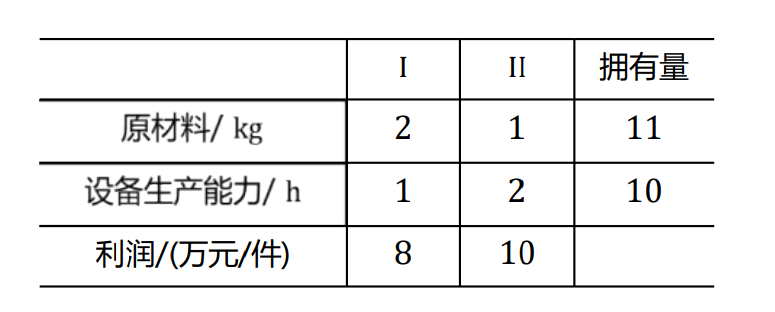
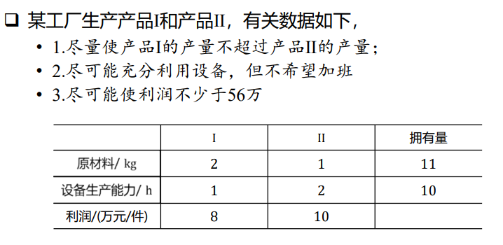
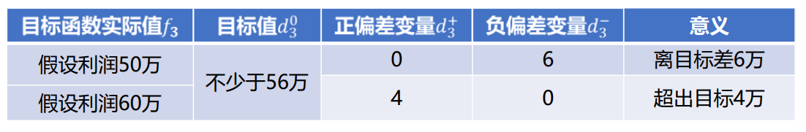

# 多目标规划
---
## 模型简介
### 本质：既要XXX，又要XXX
### 说明
- 例如，某工厂生产的产品 Ⅰ 和产品 Ⅱ，有关数据如下：

- 现在不同于以往只有一个要求，有三个要求：
    1.  尽量使**产品 Ⅰ 的产量不超过产品 Ⅱ 的产量**
    2.  尽可能**充分利用设备，但不希望加班**
    3.  尽可能使**利润不少于56万**
- 设产品 Ⅰ 生产 $x_1$ 个，产品 Ⅱ 生产 $x_2$ 个，则三个要求**翻译**过来，就是要：
    1. $x_1 \le x_2$
    2. $x_1+2x_2 = 10$
    3. $8x_1+10x_2 \ge 56$
- ***要满足的目标函数不止一个***，这种问题就叫做多目标规划问题。
### 解题思路：
1. 需要衡量每个目标的**完成情况**
2. 如果某些目标之间有**冲突**，需要在**主观上区分这些目标的重要性**
3. 使得**整体的完成情况**尽量好
### 如何***衡量***每个目标的完成情况？  
1. 引入正负偏差变量    
2. 正偏差变量 $d_i^+ = max \{f_i - d_i^0, 0\} $，为实际值**超过**目标值的部分
3. 负偏差变量 $d_i^- = -max\{f_i - d_i^0, 0\}$，为实际值**少于**目标值的部分
4. 不难看出，正负偏差变量的**取值都 $\ge 0$**，且两者至少有一个为 $0$
5. **$\ge$ 表明负偏差变量 $d_i^-$ 越小越好，$\le$ 表明正偏差变量 $d_i^+$ 越小越好，$=$ 表明两者之和 $d_i^+ + d_i^-$ 越小越好**
### 约束的分类：
- 绝对约束：例如例题的**原材料有限**即为绝对约束，是必须满足的条件
- 目标约束：即例题中的**三个目标**，它们的要求都是尽可能，不是必须要满足的条件，只用做到尽量满足。   
- 出现目标过多，难以全部都满足时，该如何做？
    - 多个目标可能难以同时满足，此时需要通过确定优先因子 $p_k$ 来决定哪些个目标优先满足。
### ***多目标规划模型建立的基本思想：***
- ***将目标约束转化为偏差变量表示的目标函数和等式约束。***
- 例如将：
$$
    8x_1 + 10x_2 \ge 56
$$ 

    转化为：
$$
    \begin{cases}
        \min p_id_3^- \\
        8x_1 + 10x_2 + d_i^- - d_i^+ = 56
    \end{cases}
$$ 
---
## 适用赛题
- 生产规划：使XXX最少/多/利润最大，且尽可能XXX，尽量XXX，在...基础上优化XXX
---
## 典型例题与原理讲解
### 例题如前：    

目标：需要衡量每个目标的**完成情况**，并区分三个目标的**重要性**，使得**整体的完成情况**尽量好
### 原理讲解：
为完成这个例题，我们需要引入三个概念：
#### 1. 正负偏差变量 —— 衡量每个目标的**完成情况**
- 解释：
    1. 设 $f_i(i=1,...,l)$ 为第i个目标函数的实际值，$d_i^0$ 表示 $f_i$的目标值   
    2. 正偏差变量 $d_i^+ = max \{f_i - d_i^0, 0\} $，为实际值**超过**目标值的部分
    3. 负偏差变量 $d_i^- = -max\{f_i - d_i^0, 0\}$，为实际值**少于**目标值的部分
    4. 例如：
- 引入了正负偏差变量之后，我们就可以写出转化后的对应目标函数:
    1. **$x_1 - x_2 \le 0$ 转化为对应 $\min d_1^+$**
    2. **$x_1 + 2x_2 = 10$ 转化为对应 $\min (d_2^- + d_2^+)$**
    3. **$8x_1+10x_2 \ge 56$ 转化为对应 $\min d_3^-$**
    4. ***补充:*** 第二个目标的转化还可以再细化，$\min (d_2^- + d_2^+)$ 中正负偏差变量的系数还可以进一步赋予**权重**。如果题目中提到 **“近期订单较多”** 之类的语句，那么 “不希望加班” 的**重要性就降低**，此时就可以将目标函数改写为：$\min (2d_2^- + d_2^+)$。本此解答不考虑这类情况，目标函数照旧。
#### 2. 绝对约束和目标约束
- **绝对约束**是模型中**自带**的约束条件，**必须满足**，否则是不可行解
- **目标约束**是模型中对不等式右端追求的值**允许有偏差**的约束条件，常见于带有 **“尽可能”** 等字样的约束中。
- 由正负偏差变量将目标约束转化为等式约束条件：
    1. **$x_1 - x_2 \le 0$ 转化为 $x_1 + x_2 + d_1^- - d_1^+ = 0$**
    2. **$x_1 + 2x_2 = 10$ 转化为 $x_1 + 2x_2 + d_2^- - d_2^+ = 10$**
    3. **$8x_1+10x_2 \ge 56$ 转化为 $8x_1+10x_2 + d_3^- - d_3^+ = 56$**
    4. ***转化核心：多退少补***
#### 3. 优先因子
- 优先因子代表***目标之间的重要性排序***，呈现方式有数值，例如该题的目标函数可表达为：
    $$
        \min (p_1d_1^+ + p_2(d_2^- + d_2^+) +p_3d_3^-)
    $$
    其中 $p_1,p_2,p_3$ 即为优先因子，我们可以为它们赋予不同的数值，例如 $p_1,p_2,p_3 = 10,5,1$
    > 但除非题目有明确的**规定三个目标的重要性之间满足某数学比例，否则不推荐这样做**  —— 这是因为你不能说明为什么它们三个目标的重要性就是这个比例，这样做的**主观因素太强**，得到的结果的**普遍性**不够。
- 针对这道题，题目没有明确表示三个目标重要性的先后顺序，我们主观规定重要性为 1 > 2 > 3，为了不太过主观，我们不对优先因子赋值，而是采用序贯算法来计算最终结果。

### 序贯算法
#### 算法思想：
- 根据优先因子的先后次序，将问题分解成单目标规划     
- 每个目标都可视为单目标的规划问题
#### 算法步骤
1. 根据模型中各个目标的优先级（优先因子），确定各目标的求解次序
2. 求第一级（最重要）单目标规划的最优值，即为 $f_1^*$
3. **以第一级单目标等于最优值 $f_1^*$ 作为新的约束加入到原问题中**，求第二级目标最优值 $f_2^*$
4. **依次递推**，直到所有目标都求完，或不存在可行解为止

### 代码：
$$
    x = [ d_1^+, d_1^-,d_2^+, d_2^-,d_3^+, d_3^-,x_1,x_2 ]        
$$
**不考虑整数约束情况，即不限定 $x_1,x_2$ 为整数：**
```python
# 序贯算法
import numpy as np
from scipy.optimize import linprog

c = np.array([1,0,0,0,0,0,0,0])
A = np.array([[0,0,0,0,0,0,2,1]])
b = np.array([11])
Aeq = np.array([[-1,1,0,0,0,0,1,-1], [0,0,-1,1,0,0,1,2], [0,0,0,0,-1,1,8,10]])
beq = np.array([0,10,56])
x0,x1,x2,x3,x4,x5,x6,x7 = (0,None),(0,None),(0,None),(0,None),(0,None),(0,None),(0,None),(0,None)
bnds = (x0,x1,x2,x3,x4,x5,x6,x7)
# 第一个目标
res = linprog(c, A, b, Aeq, beq, bounds=bnds,method='highs')
print("第一轮后")
print("x =", res.x, "fun =",res.fun)

# 第二个目标，更新c和A，b
A = np.concatenate((A, [c]),axis=0)
b = np.concatenate((b, np.array([res.fun])),axis=0)
c = np.array([0,0,1,1,0,0,0,0])
res = linprog(c, A, b, Aeq, beq, bounds=bnds,method='highs')
print("第二轮后")
print("x =", res.x, "fun =",res.fun)

# 第三个目标，更新c和A，b
A = np.concatenate((A, [c]),axis=0)
b = np.concatenate((b, np.array([res.fun])),axis=0)
c = np.array([0,0,0,0,0,1,0,0])
res = linprog(c, A, b, Aeq, beq, bounds=bnds,method='highs')
print("第三轮后")
print("x =", res.x, "fun =",res.fun)
```
**运行结果：**
```python
第一轮后
x = [ 0. 11. 12.  0. 54.  0.  0. 11.] fun = 0.0
第二轮后
x = [0.         0.         0.         0.         4.         0.
 3.33333333 3.33333333] fun = 0.0
第三轮后
x = [0.         0.         0.         0.         4.         0.
 3.33333333 3.33333333] fun = 0.0
```
<br>

**考虑整数约束情况，即 $x_1,x_2$ 只能取整数**：
```python
# 序贯算法
import pulp as pp

# 第一目标
pCase1 = pp.LpProblem("pcase1", pp.LpMinimize)

# 全局变量设置
d1 = pp.LpVariable("d1", lowBound=0,cat="integer")
d2 = pp.LpVariable("d2", lowBound=0,cat="integer")
d3 = pp.LpVariable("d3", lowBound=0,cat="integer")
d4 = pp.LpVariable("d4", lowBound=0,cat="integer")
d5 = pp.LpVariable("d5", lowBound=0,cat="integer")
d6 = pp.LpVariable("d6", lowBound=0,cat="integer")
x1 = pp.LpVariable("x1", lowBound=0,cat="integer")
x2 = pp.LpVariable("x2", lowBound=0,cat="integer")

# 目标函数设置
pCase1 += (d1)
# 约束条件设置
pCase1 += (2*x1 + x2 <= 11)
pCase1 += (x1 - x2 + d2 - d1 == 0)
pCase1 += (x1 + 2*x2 + d4 - d3 == 10)
pCase1 += (8*x1 + 10*x2 + d6 - d5 == 56)

pCase1.solve()
val1 = pp.value(pCase1.objective)

print("第一轮后")
for v in pCase1.variables():
    print(v.name, "=", v.varValue)  # 输出每个变量的最优值
print("val =", val1)  # 输出最优解的目标函数值

# 第二目标
pCase2 = pp.LpProblem("pCase2", pp.LpMinimize)

pCase2 += (d3 + d4)
pCase2 += (2*x1 + x2 <= 11)
pCase2 += (x1 - x2 + d2 - d1 == 0)
pCase2 += (x1 + 2*x2 + d4 - d3 == 10)
pCase2 += (8*x1 + 10*x2 + d6 - d5 == 56) 
# 附加第一目标作为约束条件
pCase2 += (d1 <= val1)

pCase2.solve()
val2 = pp.value(pCase2.objective)

print("第二轮后")
for v in pCase2.variables():
    print(v.name, "=", v.varValue)  # 输出每个变量的最优值
print("val =", val2)  # 输出最优解的目标函数值

# 第三目标
pCase3 = pp.LpProblem("pCase3", pp.LpMinimize)

pCase3 += (d3 + d4)
pCase3 += (2*x1 + x2 <= 11)
pCase3 += (x1 - x2 + d2 - d1 == 0)
pCase3 += (x1 + 2*x2 + d4 - d3 == 10)
pCase3 += (8*x1 + 10*x2 + d6 - d5 == 56) 
# 附加第一、二目标作为约束条件
pCase3 += (d1 <= val1)
pCase3 += (d3 + d4 <= val2)

pCase3.solve()
val3 = pp.value(pCase3.objective)

print("第三轮后")
for v in pCase3.variables():
    print(v.name, "=", v.varValue)  # 输出每个变量的最优值
print("val =", val3)  # 输出最优解的目标函数值
```
**运行结果：**
```python
第一轮后        第二轮后        第三轮后
d1 = 0.0       d1 = 0.0       d1 = 0.0
d2 = 0.0       d2 = 5.0       d2 = 2.0
d3 = 0.0       d3 = 0.0       d3 = 0.0
d4 = 10.0      d4 = 0.0       d4 = 0.0
d5 = 0.0       d5 = 0.0       d5 = 0.0
d6 = 56.0      d6 = 6.0       d6 = 0.0
x1 = 0.0       x1 = 0.0       x1 = 2.0
x2 = 0.0       x2 = 5.0       x2 = 4.0
val = 0.0      val = 0.0      val = 0.0
```
**结果分析：**
- 三级都求完了，迭代结束，求得满意解为$x_1=2，x_2=4$
- 在优先考虑尽量使产品 Ⅰ 产量不超过产品 Ⅱ ，其次尽可能充分利用设备且不加班，最后尽可能使利润不少于 56 万的情况下，应该安排每天生产 2 台设备 Ⅰ，4 台设备 Ⅱ。
- 注意：
    1. 多目标规划求得的叫做 “满意解” 而非 “最优解”。
    2. 多目标规划没有最优的概念（因为在求解过程中，目标的重要性的设定是具有主观性的）
    3. 改变目标的重要性排序，求解结果也会改变。

附 ```pulp ``` 库的使用教程：[Python小白的数学建模课-04.整数规划](https://zhuanlan.zhihu.com/p/377580152)