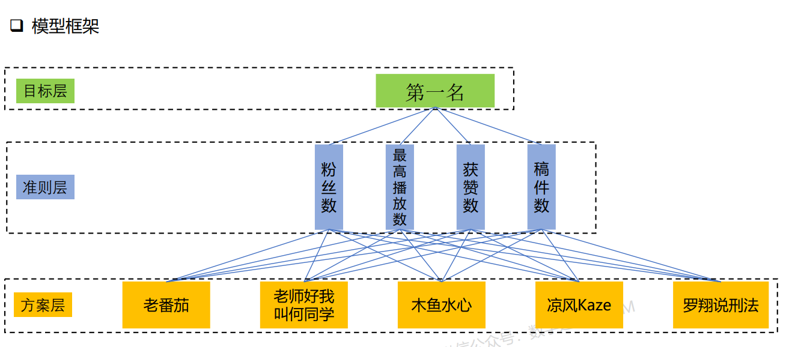
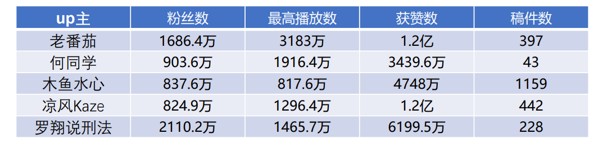
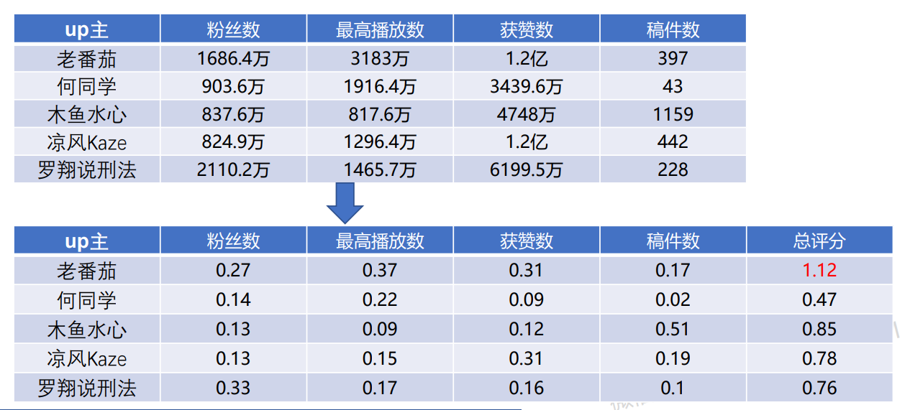
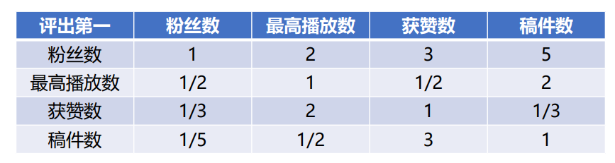
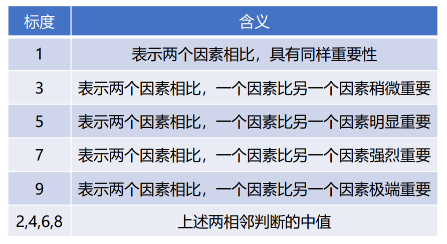
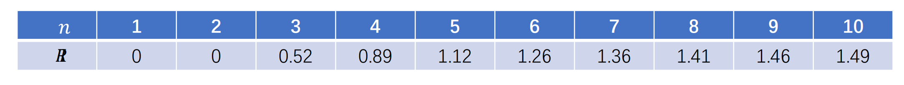
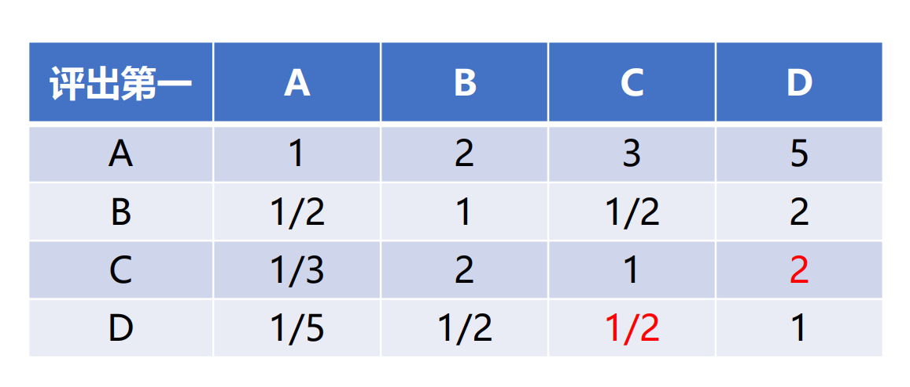
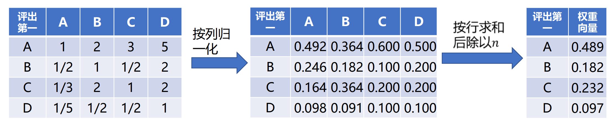
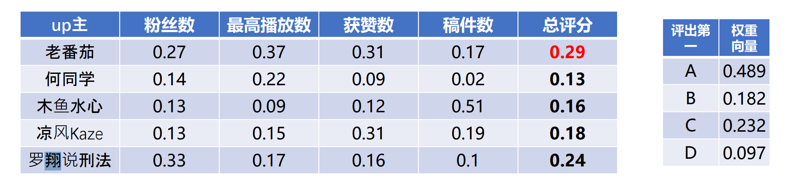

# 层次分析法
---
## 总求解步骤
1. **建立模型框架**
2. **方案——准则矩阵归一化**
3. **建立准则——判断矩阵**
4. **准则——判断矩阵**通过**一致性检验**
    1. 计算准则——判断矩阵**最大特征值**
    2. 计算**一致性比例**
    3. 判断一致性比例是否 $<$ **0.1**

5. 求解出**准则权重矩阵**
6. **方案——准则矩阵与准则权重矩阵相乘得出最终评分矩阵**
7. **分析求解的结果**

## 基本概念
### 介绍
**层次分析法**是一种解决**多目标**的复杂问题的**定性与定量相结合**的**决策分析**方法。
该方法将定量分析与定性分析结合起来，用决策者的经验判断各衡量目标能否实现的标准之间的相对重要程度，并合理地给出每个决策方案的每个标准的权数，利用权数求出各方案的优劣次序，比较有效地应用于那些**难以用定量方法解决的课题。**
### 模型框架
**模型基本框架如下：**

### 基本思想
1. 数量级相同 —— 归一化
2. 重要性排序 —— 准则具有权重

## 适用赛题
- 评选/排名
    - 目标层很明确：谁是第一、第二 ……
    - 一般题目会提供准则层和相应数据，往往有经验（文献）可循
- 决策分析
    - 面临**多种方案时**，需要依据一定的标准选择某一种方案
    - 可能需要自行查找数据、查文献确定方案层，方案层和准则层**较为复杂**
    - 不同的评价模型（评价指标和权重等不同），会得出不同的结果
- 特点
    - **方案层必须明确：** 必须从**题目中**确定所有方案
    - **缺点是具有主观性：** 评价指标的权重往往是主观设定的
    - **优点是可处理复杂系统：** 为多准则或无结构特性的复杂决策问题提供简便的决策方法

## 方法使用讲解
**假如有下面这样一个决策问题：**
> 如何根据如下 4 项准则对 5 位up主进行排序？


### 方案——准则矩阵的归一化
1. **直接简单粗暴地粉丝数+最高播放数+获赞数+稿件数，数值最大的就是第一，可行吗？**
    - 答案是：不行。
    - 指标的**数量级不同**：播放数几千万，稿件数一般几百，简单相加，这种情况下，相当于 1 个播放数与 1 个稿件数的价值是一样的，显然不实际。
2. **那么，如果要进行数据处理，该如何处理？**
    - 答案是：**归一化处理。**
    -  对每一个指标的数组 [a b c d] 归一化处理得到 [a / (a+b+c+d), b / (a+b+c+d), c / (a+b+c+d), d / (a+b+c+d)]
    - 归一化之后，不同指标数量级一致，每一个评价对象在每一个指标里**排名不变**
3. **数据处理时，要注意的点有哪些？**
    - 每一个指标的数值，在本模型中的意义，代表着 “单项排名”
    - 罗翔老师在 “粉丝数” 这一指标里单项排名第一
    - 那么要保证对数据处理之后，罗翔老师在“粉丝数”这一指标里单项排名依旧是第一
    - **即数据处理不改变原有排名**
4. **准则矩阵归一化之后的效果**
如图：


### 准则——判断矩阵的建立
1. **准则矩阵归一化后，现在可以直接相加了吗？**
    - 答案是：不行。
    -  现实中这些**准则对于排名的重要性**不同
    -  例如：一般来说，粉丝数比稿件数更能体现up主的优秀
2. **既然要体现准测的重要性，那么我给每个准则赋予一个权重，然后再相加，可以了吗？**
    - 答案依然是：不行。
    - 若假设 综合评分 = 0.4粉丝数 + 0.2播放数 + 0.3获赞数 + 0.1稿件数
    - 则权重是人为主观设定的，这也是层次分析法的缺点
    - 如此做可能会因为权重设定不当而导致极端荒谬的情况发生
3. **那么，如何较为科学地设定权重？**
    - 对准则的重要性进行**两两比较**，**构造准则——判断矩阵**，从而**求出各个准则的较为科学的权重**
    - 如何构造准则——判断矩阵？
        - 示例准则——判断矩阵如下：
        
        - 其中：$a_{ij}$ 元素的意义是：第 $i$ 个准则相对于第 $j$ 个准则的重要程度，用下表来衡量：
        

            然后，根据**主观判断或者文献检索结果**，将矩阵填满
        - 需要注意的是，准则——判断矩阵中的**对称元素互为倒数**，对角线元素均为 1
### 准则——判断矩阵的建立的一致性检验
构造出来的准则——判断矩阵还不能立即使用，还需要通过一致性检验。
- 由于**每一次两两比较的过程中暂时忽略了其他因素的影响**，所以最后的结果可能出现既 A 比 B 重要，又 B 比 A 重要的**矛盾情况**，所以需要进行一致性检验
- 一致性检验公式：
$$
    CR=\frac{CI}{RI},CI=\frac{\lambda_{max}-n}{n-1} 
$$
其中，$\lambda_{max}$ 为准则——判断矩阵的**最大特征值**，$n$ 为准则的个数，$CR$ 称为一致性比例，$RI$ 称为平均随机一致性指标，是与 $n$ 有关的常数，其与 $n$ 的关系见下表：

- 若计算出来的 $CR < 0.1$ 表明通过了一致性检验，否则，需要修改准则——判断矩阵，直到其计算出来的 $CR < 0.1$ 为止。
- 最终，可以得到如下的准则——判断矩阵

### 求解出准则权重矩阵
通过最终的准则——判断矩阵，得出各个准则的相对科学的权重
1. 将通过了一致性检验的准则——判断矩阵**按列归一化**     
2. **每一行分别求和，求和的结果除以 $n$，得到的列向量就是权重矩阵**   


### 方案——准则矩阵与准则权重矩阵相乘得出最终评分矩阵
**矩阵相乘即可：**


## 代码求解
**上述例题的求解代码如下：**
```python
import numpy as np

# 归一化后的方案——准则矩阵
A = np.mat('0.27 0.37 0.31 0.17; 0.14 0.22 0.09 0.02; 0.13 0.09 0.12 0.51; 0.13 0.15 0.31 0.19; 0.33 0.17 0.16 0.10')
print("方案——准则矩阵：", A)

# 平均随机一致性指标
RI = [0,0,0.52,0.89,1.12,1.26,1.36,1.41,1.46,1.49]
# 准则——判断矩阵
B = np.array([[1, 2, 3, 5], [1/2, 1, 1/2, 2], [1/3, 2, 1, 2], [1/5, 1/2, 1/2, 1]])
# print(B)
n = 4
# 特征值，特征向量
value, vector = np.linalg.eig(B)
# 最大特征值
lmd = max(value)
# 一致性比例
CR =  (lmd-n) / (n-1)
# 一致性检验
if CR < 0.1 :
    print("通过了一致性检验")
else :
    print("未通过一致性检验")
    exit(-1)

# 按列归一化   
sumval = 0
val = []
for i in range(n):
    for j in range(n):
        sumval += B[j][i]
    val.append(sumval)
    sumval = 0
    
# print(val)
deduce1Val = []
for i in range(n):
    for j in range(n):
        deduce1Val.append(B[i][j] / val[j])

def chunk_list(lst, chunk_size):
    return [lst[i:i + chunk_size] for i in range(0, len(lst), chunk_size)]

finalB =  chunk_list(deduce1Val, 4)       
# print(finalB)

# 权重矩阵
weightMat = []
for i in range(n):
    weightMat.append(sum(finalB[i][0:]) / n)
    
# print(weightMat)
w = np.array(weightMat)
print("权重矩阵：", w)

# 得分矩阵
points = np.dot(A, w)
# print(points)
name = ['老番茄','何同学','木鱼水心','凉风','罗翔']
print("最终得分：", {name[i]:points[0,i] for i in range(5)})
```
**运行结果：**
```python
方案——准则矩阵： 
[[0.27 0.37 0.31 0.17]
 [0.14 0.22 0.09 0.02]
 [0.13 0.09 0.12 0.51]
 [0.13 0.15 0.31 0.19]
 [0.33 0.17 0.16 0.1 ]]
通过了一致性检验
权重矩阵： [0.48885991 0.18192996 0.2318927  0.09731744]
最终得分： {'老番茄': 0.2877369597615499, '何同学': 0.13128166915052158, '木鱼水心': 0.15738450074515647, '凉风': 0.18121833084947836, '罗翔': 0.23908643815201192}
```

代码参考：[层次分析法之python](https://blog.csdn.net/qq_25990967/article/details/122820595)