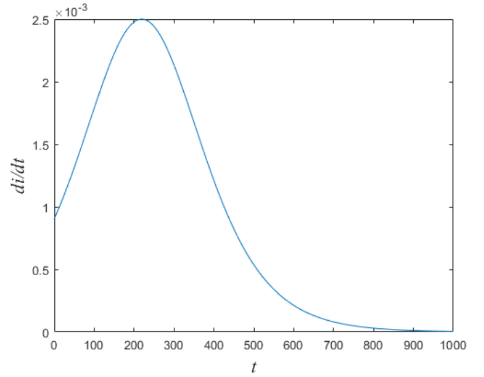

# 微分方程传染病模型

---

## 模型演变

从上到下依次递进

- 指数传播模型
- SI 模型
- SIS 模型
- SIR 模型

下面将会一一介绍模型的演变，分析它们解决的问题和不足，并给出最终较为完备的 SIR 模型的解决方案。

本节的重点：模型假设与模型改进的思想

## 指数传播模型

### 模型的假设

1. 假设所研究的区域是封闭区域，在一定时期内人口总量不变，不考虑迁入和迁出
2. 在 $t$ 时刻患病人数 $N(t)$ 是随时间连续变化的、可微的函数
3. 每个病人在单位时间内会传染到的易感者人数为大于 0 的常数 $\lambda$
4. 易感者患病后不再痊愈，一直为患病者，且不会死亡

### 模型的建立

- 设 $N(t)$ 为 $t$ 时刻患病人数，则 $t+\Delta t$ 时刻的患病人数为 $N(t+\Delta t)$
- 则从 $t$ 到 $t+\Delta t$ 这段时间内，净增的患病人数为 $N(t+\Delta t)-N(t)$
- 则根据第三个假设，有：

$$
  N(t+\Delta t)-N(t)=\lambda N(y) \Delta t
$$

- 注意：$\lambda$ 在模型中始终是常数

### 微分方程

- 基于以上的模型建立过程，在上面公式等号量变除以 $\Delta t$ ，并令 $\Delta \to 0$
- 可得微分方程：

$$
  \begin{cases}
  \frac{dN(t)}{dt}=\lambda N(t) \\
  N(0)=N_0
  \end{cases}
$$

- 可求得该模型得解析解： $N(t)=N_0 e^{\lambda t}$

### 结果分析

- 该模型结果显示，患病人数是指数型增长的
- 该模型一般适用于传染病爆发初期
- 因为在初期，传染源和传染途径往往未知，难以防范
- 但是按照该模型，$t \to \infty$ 时 $N(t) \to \infty$，这显然是不符合实际的

### 模型改进

- 封闭区域内人数有限，当患病人数越来越多时，易感者的数量也就越来越少
- 那么单位时间内新增的人数也会减少，因为没有多少人可以被感染了
- 基于以上分析，对模型进行改进，建立 SI 模型

## SI 模型

### 模型假设

1. 人口总数：研究的区域内人口总数为常数 N，既不考虑生死，也不考虑迁移
2. 两类人群：人群分为易感染者（Susceptible）和易感染者（Infective），设 $t$ 时刻两类人群在总人口中所占的比例分别为 $s(t)$ 和 $i(t)$，显然 $s(t)+i(t)=1$
3. 日感染率：每个病人在单位时间内接触的平均人数为常数 $\lambda$，这称为日感染率
4. 不考虑治愈：每个病人得病后在传染期内无法治愈，且不会死亡

### 注意事项

- 现实中，地区人数并不会真的为常数，总有出生，死亡，迁入和迁出
- 但若把这些因素考虑进模型，模型会非常复杂；而本节的重心是传染病
- 再次强调模型假设的目的：简化问题

### 模型建立

- 1 个病人单位时间内可以使 $\lambda s(t)$ 个易感者变为感染者
- 在 $t$ 时刻病人总数为 $Ni(t)$，$\Delta t$ 时间内会新增 $\lambda Ni(t)s(t) \Delta t$ 个感染者，则单位时间内新增感染者人数为：

$$
  \frac{N(t+ \Delta t)-N(t)}{\Delta t}=\lambda Ni(t)s(t)
$$

- 令 $\Delta t \to 0$，可得微分方程：

$$
  \frac{di(t)}{dt}=\lambda s(t)i(t)
$$

- 由 $s(t)+i(t)=1$，所以可以写作：

$$
  \frac{di(t)}{dt}=\lambda (1-i(t))i(t)
$$

- 设 $t=0$ 时，患病人数占总人口的比例为 $i(0)=i_0$，则 SI 模型建立的微分方程如下：

$$
  \begin{cases}
  \frac{di(t)}{dt}=\lambda (1-i(t))i(t), & t>0 \\
  i(0)=i_0
  \end{cases}
$$

- 求解该微分方程，可得解析解：

$$
  i(t)=\frac{1}{1+(\frac{1}{i_0}-1)e^{-\lambda t}}
$$

- 该模型其实就是 Logistic 模型，$i(t)$ 是病人占总人口的比例，最大值为 1，即当 $t \to \infty$ 时，区域内所有人都被感染
  
### 模型结果

- 医学上称 $d(i)/dt$ 为传染病曲线，表示传染病人增加率与时间的关系，如下图：
  - 
- 预测结果如下图所示：
  - 
- 当病人总量占总人口比值达到 50%，即 $i=0.5$ 时，$d(i)/dt$ 达到最大值，此时为传染高峰期
- 根据 $i(t)$ 表达式，可得高峰去对应时刻：$t_m=\frac{1}{\lambda} \ln (\frac{1}{i_0}-1)$

### 结果意义

- 高峰期对应时刻 $t_m$ 在医学上具有重要意义
- 提前预防：若已知日接触率 $\lambda$（统计调查等），可预测高峰期到来的时间 $t_m$，做好应对准备
- 由于 $t_m$ 与 $\lambda$ 成反比，若能减小 $\lambda$（隔离，戴口罩等），则 $t_m$ 变大
- $t_m$ 变大也就意味着传染病高峰期来的越晚，现实中就可能在高峰期到来之前就彻底解决了该传染病
- 注意：比赛时需要根据数学结果，分析求解结果的现实意义，写进论文

### 模型改进

- SI 模型中未考虑病人得病后可以治愈，$t \to \infty$ 时 $i(t) \to 1$，即最后所有人都被传染
- 问题源自模型假设中只有易感者变为病人，但病人不会康复变为易感者，这显然不合理
- 进一步分析问题，可建立 SIS 模型

## SIS 模型

### 模型假设

在 SI 模型假设的基础上，进一步假设：

1. 治愈比例：每天被治愈的病人人数占病人总数的比例为 $\mu$
2. 无免疫性：病人被治愈后仍可被再次感染

### 模型建立

根据以上模型假设，只需要在传染者变化方程的右边减去治愈的人数即可：

$$
  \begin{cases}
  \frac{di(t)}{dt}=\lambda (1-i(t))i(t)-\mu i(t), & t>0 \\
  i(0)=i_0
  \end{cases}
$$

 
SIS 模型的解析解为：

$$
  i(t)= 
  \begin{cases}
  [\frac{1}{1- \frac{1}{\sigma}}+(\frac{1}{i_0}-\frac{1}{1- \frac{1}{\sigma}})e^{-\lambda(\frac{1}{1- \frac{1}{\sigma}})t}]^{-1}, & \sigma \ne 1 \\
  (\lambda t+\frac{1}{i_0})^{-1}, & \sigma=1
  \end{cases}
$$

其中，$\sigma=\frac{\lambda}{\mu}$，称为传染强度，当 $t \to \infty$ 时，可得：

$$
  i(\infty)=
  \begin{cases}
  1-\frac{1}{\sigma}, &\sigma>1 \\
  0,&\sigma \le 1
  \end{cases}
$$

可见，传染强度 $\sigma$ 是一个阈值

- 若小于 1，则随着时间的流逝，最终所有病人都会被治愈
- 若大于 1，则不管过多久，总有一定比例的人口会被传染成病人，传染病永远无法根治

### 模型改进

- 进一步考虑，有一些疾病例如天花、麻疹、流感、肺炎在治愈后有很强的免疫力，不会再被感染
- 因此，考虑免疫性，改进 SIS 模型为 SIR 模型

## SIR 模型

### 模型假设

1. 人群分为易感者，病人和病愈后有免疫力而退出系统的移出者
2. 设任意时刻 $t$，这三类人群占总人口的比例分别为 $s(t),i(t)$ 和 $r(t)$
3. 设病人每天能接触的非移出者（即易感者和感染者）为 $\lambda$，每日治愈病人人数占总病人人数的比例为 $\mu$
4. 人口总数 N 为固定常数，既不考虑生死，也不考虑迁入和迁出

### 模型建立

- 显然：$s(t)+i(t)+r(t)=1$
- 对于移出者：$\frac{dr}{dt}=\mu i(t)$
- 对于传染者：$\frac{di}{dt}=\lambda s(t)i(t)-\mu i(t)$
- 对于易感者：$\frac{ds}{dt}=-\lambda s(t)i(t)$
- 可建立如下微分方程：

$$
  \begin{cases}
  \frac{di}{dt}=\lambda s(t)i(t)-\mu i(t) \\
  \frac{ds}{dt}=-\lambda s(t)i(t) \\
  \frac{dr}{dt}=\mu i(t) \\
  i(0)=i_0,s(0)=s_0,r(0)=r_0
  \end{cases}
$$

### 模型分析

- SIR 模型形式上是多个相互关联的系统变量之间的常微分方程组，属于典型的系统动力学模型
- 更复杂的情况，考虑有些传染病具有潜伏期，增加考虑一类人为潜伏着，建立 SEIR 模型
- 类似的问题：河流各类污染物质的耗氧、复氧、吸附、沉降等
- 该类问题往往难以求得精确的解析解，只能求得数值解
