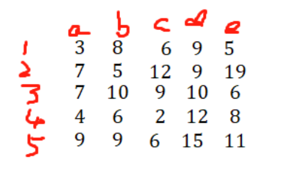

# 整数规划之指派问题
---
## 指派问题的概念
- **指派问题是那些派完成任务效率最高的人去完成任务的问题。** 
- 在生活中经常遇到这样的问题，**某单位需完成 n 项任务，恰好有 n 个人可承担这些任务。** 由于每人的专长不同，各人完成任务不同(或所费时间)，效率也不同。于是产生应指派哪个人去完成哪项任务，**使完成 n 项任务的总效率最高(或所需总时间最小)。**
- 这类问题称为**指派问题或分派问题。**
## 指派问题的标准形式
***指派问题的核心是指派矩阵***

- 指派矩阵如上所示，其意思是说列项表示人数，行项表示每人完成某项任务的时间或者效率，目标函数即为求取给每人安排一项任务，使所有人完成任务的时间最短或者效率最高。
- 如 3 表示第 1 个人完成任务 a 的时间或者效率，8 表示第 1 个人完成 b 任务的时间或者效率。
## 代码
以上面的指派矩阵为例，其最优指派的 python 代码如下：
```python
import numpy as np
from scipy import optimize
c = [[3,8,6,9,5], [7,5,12,9,19], [7,10,9,10,6], [4,6,2,12,8], [9,9,6,15,11]]
c = np.array(c)

name_id,work_id=optimize.linear_sum_assignment(c)
print("name_id =", name_id)
print("work_id =", work_id)
print("minimize time =", c[name_id,work_id ].sum())
```
**运行结果：**
```python
name_id = [0, 1, 2, 3, 4]
work_id = [0, 3, 4, 2, 1]
minimize time = 29
```
**结果分析：**
对于第一个人分配的是 a 任务，第二个人分配的是 d 任务，第三个人分配的是 e 任务，第四个人分配的是 c 任务，第五个人分配的是 b 任务，这样的用时最短，或者效率最高。

## 人数少任务多的指派问题
例如：如5个人指派7个任务
解决方案：做法是将**人数进行分身，即每个人分为2个人**，添加3个**虚拟任务**，构成一个10x10的指派矩阵，虚拟任务的用时设为0.

文章参考：[python数学建模之用optimize.linear_sum_assignment解决模型优化之指派问题](https://blog.csdn.net/qq_51570094/article/details/124020861)