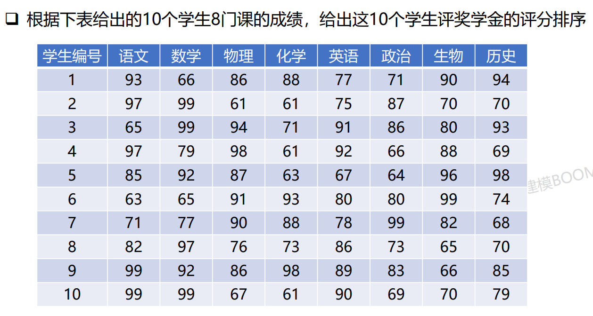

# 熵权法
---
## 方法简介
该方法用于求指标的权重，其求出的权重是**完全客观的**，不参杂任何主观因素，适用于缺乏主观依据的评价性问题
## 使用步骤
1. 数据标准化
2. 计算各个指标的变异系数
3. 由变异系数求指标的权重

## 使用讲解
讲解将结合以下示例进行：

### 数据标准化
- 标准化的原因：
    - 评价体系中，存在数值越大越好的正向指标，也存在数值越小越好的负向指标，还存在数值越接近某个值越好的某点最优指标
    - 不同指标的数量级也可能不同
    - 求熵的公式中用到了对数函数，其自变量不允许出现负值
- 以下，$i$ 代表某个方案序号，$j$ 代表某个指标序号
- 正向指标标准化：
$$
    a_{ij} = \frac{x_{ij}- \min \{x_{1j},...,x_{nj}\}}{\max \{x_{1j},...,x_{nj}\} - \min \{x_{1j},...,x_{nj}\}}
$$

- 负向指标标准化：
$$
    a_{ij} = \frac{\max \{x_{1j},...,x_{nj}\}- x_{ij}}{\max \{x_{1j},...,x_{nj}\} - \min \{x_{1j},...,x_{nj}\}}
$$

- 某点最优指标标准化（设 a 为最优点）：
$$
    a_{ij} =1- \frac{|x_{ij}-a|}{\max \{|x_{ij}-a|\}}
$$

- 标准化之后，$a_{ij}$ 的所有值都在区间 [0, 1] 内，且都是数值越大，现实意义越好

### 计算变异系数
设每个评价对象在各个指标中的比重为 $p_{ij}$， 第 $j$ 个指标的熵值为 $e_j$，第 $j$ 个指标的变异系数为 $g_j$，有如下公式：
$$
    p_{ij} = \frac{a_{ij}}{\sum_{i=1}^n{a_{ij}}}
$$

$$
    e_j=-\frac{1}{\ln n}\sum_{i=1}^n{p_{ij}\ln p_{ij}}
$$

$$
    g_j = 1 - e_j
$$

显然熵值越大，变异系数越小，代表该指标越有序，该指标的信息量越小

### 计算权重
第 $j$ 个指标的权重如下计算：
$$
    w_j = \frac{g_j}{\sum_{j=1}^m{g_j}}
$$

指标的变异系数越大，信息量越大，相应指标的权重也越大

## 最终求解
计算出各个指标的权重之后，就可以对每个方案进行加权求和得到总得分，进而比较出次序了。

**示例的代码求解如下：**
```python
import numpy as np
import math

n = 10
data = np.mat('93 66 86 88 77 71 90 94;'
              '97 99 61 61 75 87 70 70;'
              '65 99 94 71 91 86 80 93;'
              '97 79 98 61 92 66 88 69;'
              '85 92 87 63 67 64 96 98;'
              '63 65 91 93 80 80 99 74;'
              '71 77 90 88 78 99 82 68;'
              '82 97 76 73 86 73 65 70;'
              '99 92 86 98 89 83 66 85;'
              '99 99 67 61 90 69 70 79')

A = np.mat('93 66 86 88 77 71 90 94;'
           '97 99 61 61 75 87 70 70;'
           '65 99 94 71 91 86 80 93;'
           '97 79 98 61 92 66 88 69;'
           '85 92 87 63 67 64 96 98;'
           '63 65 91 93 80 80 99 74;'
           '71 77 90 88 78 99 82 68;'
           '82 97 76 73 86 73 65 70;'
           '99 92 86 98 89 83 66 85;'
           '99 99 67 61 90 69 70 79')

A = A.astype(float)  # 将矩阵元素类型转换为 float
# print("A:", A)
for i in range(8):
    A[: , i] -= np.min(A[: , i])
    # print(A[: , i])
    A[: , i] /= np.max(A[: , i]) - np.min(A[: , i])
    # print(A[: , i])
    
A[A==0] = 0.000001
# print(A)

for i in range(8):
    A[: , i] /= np.sum(A[: , i])
    
# print(A)

e = []
for i in range(8):
    temp = np.log(A[: , i]).T
    # temp = temp.T
    e.append(-(1/math.log(n))*np.sum(np.dot(temp,A[: , i])))
    
# print(e)

w = []
for i in range(8):
    w.append(e[i]/sum(e))
    
# print(w)
points = []
for i in range(10):
    points.append(sum([data[i,j]*w[j] for j in range(8)]))
   
# print(points)

res = {i + 1:points[i] for i in range(len(points))}
res = dict(sorted(res.items(),key=lambda x:x[1], reverse=True))
resList = list(res.keys())
print("总结果为:", res)
print("即总排名为:", resList)
```
**运行结果为：**
```python
总结果为: {9: 87.22786414041295, 3: 85.12657130934787, 1: 82.8785918223135, 4: 81.95997431622197, 7: 81.63602104506572, 5: 81.56186253550865, 6: 80.4264005272025, 10: 79.68964710095796, 8: 78.07661923690297, 2: 77.81777072282156}
即总排名为: [9, 3, 1, 4, 7, 5, 6, 10, 8, 2]
```