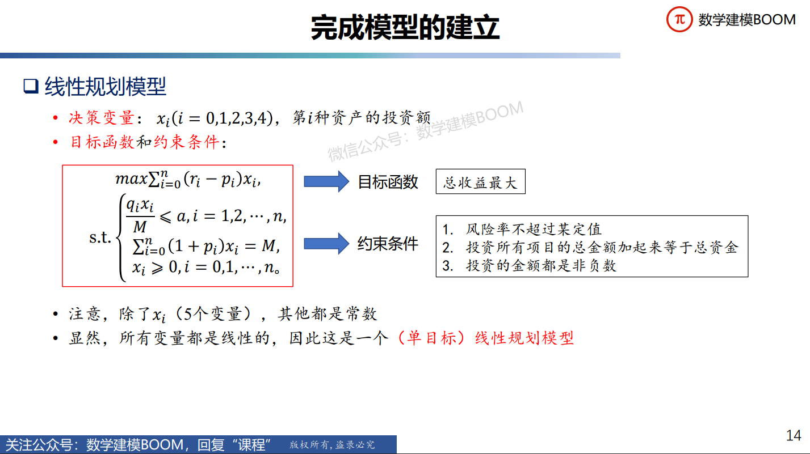

# 线性规划

---

## 模型分析
### 三要素
- **决策变量**：即建模中所设定的变量
- **目标函数**：求最优值所建立的函数
- **约束条件**：求最优值所面临的资源限制


### 模型总结
- 要解决的问题是**优化类**问题（有限的资源，最大的收益）
- 所有(变量)的关系式都是**线性**的，不存在$x^2$, $e^x$,  $\frac{1}{x}$,  $\sin x$,  $log_2x$ 等等之类的
- 线性规划模型：在一组线性约束条件下，求线性目标函数的最大值或最小值
- **线性规划标准矩阵形式（规范形式）**：
- **线性规划一般矩阵形式（优化形式）**：
<br>

---

## 适用赛题
### 1. 生产安排
- 原材料、设备有限制
- **总利润最大**
### 2. 投资收益
- 涉及资产配置、收益率、损失率、组合投资
- **总收益最大**
### 3. 销售运输
- 产地、销地、产量、销量、运费
- **总运费最省**
### 4. 车辆安排
- 路线、起点终点、承载量、时间点
- **车次安排最合理**

### 注意事项
- 收益率 = 收益/成本，设收益率为r，收益为g，成本为c
- 如果要求“**总收益最大**”，一般可以用线性规划
- 如果要求“**总收益率最大**”，一般是非线性规划（不绝对）
- **松弛变量的引入**：
- **引入松弛变量的情形**： 

---

## 典型例题


#### 问题
给该公司设计一种投资组合方案，用给定的资金M，有选择地购买若干种资产或存银行生息，**使净收益尽可能大，总体风险尽可能小。**

---

#### 步骤
##### 问题分析：
- 有**目标函数**（净收益尽可能大、总风险尽可能小）
- 有**约束条件**（总资金有限，和隐含数学条件：每一笔投资都是非负数）

##### 基本假设：
- 由于**投资数额M相当大，而题目设定的定额$𝑢_𝑖$相对M很小**，**$𝑝_𝑖 𝑢_𝑖$更小**，因此假设每一笔交易
额$𝑥_𝑖$**都大于对应的定额$𝑢_i$**
- 做假设可以**简化模型**，这个假设将交易额从考虑分段函数变为了考虑线性函数，使得研究问题*简化*
<br>

##### 模型建立：
- **决策变量**：投资每个项目$s_i$的金额设为$x_i$，总收益设为Q
- **目标函数**：净收益尽可能大，总风险尽可能小
$$
    Q = max\sum_{i=0}^{4}(r_i - p_i)x_i
$$

$$
    min\{max\{q_ix_i\}\}
$$
- **约束条件**：投资总额为M，每一笔投资是非负数
$$
    \sum_{i=0}^{4}(1+p_i)x_i=M
$$

$$
    x_i\ge0, i=0,1,...,n
$$
- **多目标线性规划模型**
<br>

##### 模型简化：
- *现实中，不同人所能承受的风险不同*
- 设某一类投资者，能接受的**最大投资风险率**为定值$a$
- **只要风险率小于等于该定值$a$，可视为对该类投资者满足“总风险尽可能小”**
- 即风险率（风险率=投资额*损失率/总资产）满足：
$$
    \frac{q_ix_i}{M} \le a, i=0,1,...,5
$$
- 基于该简化，将**目标函数** $min\{max\{q_ix_i\}\}$ **转化为了约束条件** $\frac{q_ix_i}{M} \le a$
<br>

##### 总的建立出的模型如下所示：

<br>

##### 关于$a$的问题

> 前面的模型假设中我们假定了a是常量，但实际情况中，a往往根据投资人的不同而变化，我们建立的模型存在局限性，如何改进？
- 可以为$a$赋不同的值，并分别进行求解，此操作可实现把$a$作为了模型的变量，一定程度上降低了模型局限性。
---

## 代码

```python
import numpy as np
import pandas as pd
from scipy.optimize import linprog

reslist = []
M = 10000
a = 0.001

while a <= 0.051:
    c = np.array([-0.05, -0.27, -0.19, -0.185, -0.185])
    Aeq = np.array([[1, 1.01, 1.02, 1.045, 1.065]])
    beq = np.array([M])
    A = np.array([[1, 0, 0, 0, 0], [0, 0.025/M, 0, 0, 0], [0, 0, 0.015/M, 0, 0], [0, 0, 0, 0.055/M, 0], [0, 0, 0, 0, 0.026/M]])
    b = np.array([a, a, a, a, a])
    x0, x1, x2, x3, x4 = (0, None), (0, None), (0, None), (0, None), (0, None)
    res = linprog(c, A, b, Aeq, beq, bounds = (x0, x1, x2, x3, x4))
    if res.fun is None :
        reslist.append({a : None})
        print(res)
    else :    
        reslist.append({a : abs(res.fun)})
    a = a + 0.001

print(reslist)

df = pd.DataFrame(reslist)
df.to_excel('C:\\Users\\24562\\Desktop\\美赛建模\\Learn\\models\\线性规划\\code\\ExampleSolution.xlsx', index = False)
```
### 注解
#### 矩阵的运算
- 引入库numpy
- 生成向量语法```a = np.array([...])```
- 矩阵加法```sum = a + b```, 其中加法运算符已被重载
- 数乘：```e = 3 * a```, *运算符被重载
- 点乘：```e = np.dot(a, b)```，点乘也可以计算两个矩阵的乘积
- 叉乘：```e = a * b```
- 转置：```a.T```
- 求逆：```e = np.linalg.inv(a)```
- 行列式：```e = np.linalg.det(a)```
- 求秩：```e = np.linalg.matrix_rank(a)```

#### 线性规划求一次方程组：
- 步骤：
    1. 熟记线性规划规范矩阵形式:
    $$
        \min c^Tx
    $$
    
    $$
        s.t. \begin{cases}
        Ax \le b \\
        Aeq·x=beq \\
        lb \le x \le ub 
        \end{cases}
    $$

    2. 创建每个项的变量：
    ```python
    c = np.array([-0.05, -0.27, -0.19, -0.185, -0.185])
    Aeq = np.array([[1, 1.01, 1.02, 1.045, 1.065]])
    beq = np.array([M])
    A = np.array([[1, 0, 0, 0, 0], [0, 0.025/M, 0, 0, 0], [0, 0, 0.015/M, 0, 0], [0, 0, 0, 0.055/M, 0], [0, 0, 0, 0, 0.026/M]])
    b = np.array([a, a, a, a, a])
    x0, x1, x2, x3, x4 = (0, None), (0, None), (0, None), (0, None), (0, None)        
    ```
    3. 使用numpy库函数linprog得到线性规划结果：
       ```python
       res = linprog(c, A, b, Aeq, beq, bounds = (x0, x1, x2, x3, x4))```
    4. 打印res ```print(res)```

- 附```linprog```函数的各个参数的含义：
  |参数|含义|
  |:-:|:--:|
  |c|目标函数的决策变量对应的系数向量(行列向量都可以，下同)| 
  |A_ub|不等式约束组成的决策变量系数矩阵|
  |b_ub|由A_ub对应不等式顺序的阈值向量|
  |A_eq|等式约束组成的决策变量系数矩阵|
  |b_eq|由A_ub对应等式顺序的阈值向量|
  |bounds|表示决策变量x连续的定义域的n×2维矩阵，None表示无穷|
  |method|调用的求解方法，下给出详细解释|
  |callback|选择的回调函数|
  |options|求解器选择的字典|
  |x0|初始假设的决策变量向量，若可行linprog会对方法优化|

     method参数：method参数是选择linprog的求解器方法，可选参数由一个字典包括
    ```LINPROG_METHODS = ['simplex', 'revised simplex', 'interior-point', 'highs', 'highs-ds', 'highs-ipm']```
    <br>
    建议选择highs的三个方法，因为其在速度和精确度上都更加优越。直接选择highs将会自动选择highs-ds和highs-ipm中更好的一个。
    
---
## 最终可以得到如下的曲线图

> 可见，当风险大于等于0.025时，收益便不再变化，通过这张图我们可以轻松得到投资额的最佳配置。

代码参考：[数学建模导论：基于Python语言（2022年秋季学期）](https://www.bilibili.com/video/BV12W4y1C7Tr?p=4&vd_source=67d967b1535f0d3727cf3d2be486e390)