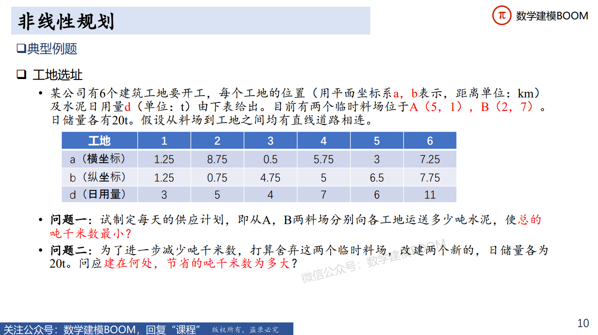

# 非线性规划
---
## 模型介绍
### 何时建立非线性规划模型？
- 若模型中至少有一个**变量**是非线性的时候，就需要使用非线性规划模型
- 这个变量的非线性可以体现在目标函数或约束条件**任意一个中**。
### 与线性规划的区分
- 形式上与线性规划非常类似，但在数学上求解却困难很多
    - 线性规划有通用的求解准确解的方法（单纯形法），**一定**能求得最优解
    - 非线性规划在数学上没有适合各种问题的**通用**解法求解严格的**数值解**
    - 但可以通过python中的科学计算库求得**近似解**
- 求解困难原因
    - 线性规划的最优解只存在于**可行域的边界**（尤其是顶点）上
    - 非线性规划的最优解则***可能在可行域内的任意一点***
---
## 适用赛题
- 本质上和线性规划一样，适用于**最优化**，求“怎样安排”“最大/小”“最优”等等
- 常见**收益率、病毒传播率、经济增长率**等等涉及变量比值的规划问题
- **空间运动**：空间约束、避免碰撞，求如何使调整角度尽量小等等
    - 例如**飞行管理、卫星轨道调整**等，已知速度…，距离最小…，调整角度不超过…，所占空间…，最小碰撞距离…；
    - 问如何调整能使角度调整的幅度尽量小/消耗尽量少。
    - **空间运动往往是曲线、变换角度等**，常用到三角函数、指数函数和变量比值等，属于非线性
    - 类似还有**电影院座位最佳视角问题**，涉及角度
- **选址问题**：已知坐标、运送物品，求如何设置新位置使运量最多/最省等等
    - 例如新建工地、搬迁等，已知各个工地的位置坐标，当前各工厂的货物需求量...，各种路径的单位距离运输量
    - 问新工场建在何地能使单位距离运输量最大
    - 选址问题涉及坐标点距离，**用到两点距离公式**$\sqrt{(x_1-x_2)^2+(y_1-y_2)^2}$，属于非线性。
---
## 典型例题-工地选址


---
### 第一小题解决方案
1. 确定决策变量
    - 设第$i$个工地的坐标为$(a_i,b_i)$，水泥日用量为$d_i, i=1,2,...,6$；料场位置$(x_j,y_j)$，日储量为$e_j,j=1,2$，从料场$j$向工地$i$的运送量为$X_{ji}$
2. 确定约束条件
   - 料场水泥运输量总量不超过其日储量：
    $$
        \sum_{i=1}^{6}{X_{ji}} \le e_j, j=1,2
    $$  
    - 两个料场向某工地运输量之和等于该工地的水泥日用量：
    $$
        \sum_{j=1}^{2}{X_{ji}}=d_i, i=1,2,...,6
    $$
3. 确定目标函数
    - 使总吨千米数最小，即运送量乘以运送距离之和最小
    $$
        \min f = \sum_{j=1}^{2}\sum_{i=1}^{6}{X_{ji}}\sqrt{(x_j-a_i)^2+(y_j-b_i)^2}
    $$    
4. 综上，可以建立规划模型：   
    $$
        \min f = \sum_{j=1}^{2}\sum_{i=1}^{6}{X_{ji}}\sqrt{(x_j-a_i)^2+(y_j-b_i)^2}
    $$

    $$
        s.t.\begin{cases}
        \sum_{i=1}^{6}{X_{ji}} \le e_j, j=1,2 \\
        \sum_{j=1}^{2}{X_{ji}}=d_i, i=1,2,...,6
        \end{cases}
    $$
<br>    
> 分析：所求目标函数中变量$X_{ji}$都是一次项，约束条件中也都是一次项，所以所有变量都是线性的，故此小题建立的规划模型是线性规划模型，运用线性规划模型求解策略即可解决

5. 代码：
```python
import numpy as np
from scipy.optimize import linprog

a = [1.25, 8.75, 0.5, 5.75, 3, 7.25]
b = [1.25, 0.75, 4.75, 5, 6.5, 7.75]
d = [3, 5, 4, 7, 6, 11]
x1 = 5
y1 = 1
x2 = 2
y2 = 7
distance1 = []
distance2 = []

for i in range(len(a)):
    distance1.append(np.sqrt((a[i] - x1)**2 + (b[i] - y1)**2))
    
for i in range(len(a)):
    distance2.append(np.sqrt((a[i] - x2)**2 + (b[i] - y2)**2))    
    
# print(distance1)   
# print(distance2)
temp = []
for i in range(len(a)):
    temp.append(distance1[i])

for i in range(len(a)):
    temp.append(distance2[i])

c = np.array(temp)    

A = np.array([[1,1,1,1,1,1,0,0,0,0,0,0], [0,0,0,0,0,0,1,1,1,1,1,1]])
b = np.array([20,20])

Aeq = np.array([[1,0,0,0,0,0,1,0,0,0,0,0], [0,1,0,0,0,0,0,1,0,0,0,0], [0,0,1,0,0,0,0,0,1,0,0,0], [0,0,0,1,0,0,0,0,0,1,0,0], [0,0,0,0,1,0,0,0,0,0,1,0], [0,0,0,0,0,1,0,0,0,0,0,1]])
beq = np.array(d)

x11,x12,x13,x14,x15,x16,x21,x22,x23,x24,x25,x26 = (0,d[0]),(0,d[1]),(0,d[2]),(0,d[3]),(0,d[4]),(0,d[5]),(0,d[0]),(0,d[1]),(0,d[2]),(0,d[3]),(0,d[4]),(0,d[5])

res = linprog(c, A, b, Aeq, beq, bounds = (x11,x12,x13,x14,x15,x16,x21,x22,x23,x24,x25,x26), method = 'highs')

print(res)
```
6. 运行结果：
```python
x = [3, 5, 0, 7, 0, 1, 0, 0, 4, 0, 6, 10]
fun = 136.22751988318154
```
即目前位置的最小吨千米数为136.2275吨千米
<br>

### 第二小题解决方案
#### 解决步骤
1. 确定决策变量：
   - 在第一小题的基础上，**增加四个变量，即两个料场的位置坐标**$(x_1,y_1)$和$(x_2,y_2)$
2. 确定约束条件：
   - 分析可得，约束条件同第一小题一样不变
    $$
        \sum_{i=1}^{6}{X_{ji}} \le e_j, j=1,2
    $$  

    $$
        \sum_{j=1}^{2}{X_{ji}}=d_i, i=1,2,...,6
    $$
3. 确定目标函数：
   - 目标函数相同，但是其中的$x_j, y_j$已经变成了变量，不是常量了
    $$
        \min f = \sum_{j=1}^{2}\sum_{i=1}^{6}{X_{ji}}\sqrt{(x_j-a_i)^2+(y_j-b_i)^2}
    $$
4. 建立规划模型：
    $$
        \min f = \sum_{j=1}^{2}\sum_{i=1}^{6}{X_{ji}}\sqrt{(x_j-a_i)^2+(y_j-b_i)^2}
    $$

    $$
        s.t.\begin{cases}
        \sum_{i=1}^{6}{X_{ji}} \le e_j, j=1,2 \\
        \sum_{j=1}^{2}{X_{ji}}=d_i, i=1,2,...,6
        \end{cases}
    $$
> 分析：目标函数中，变量$x_j,y_j$的次数不是一次，所以此小题建立的规划模型是非线性规划模型，需要采取不同于线性规划模型的解法来解决
        
#### 非线性规划模型解决方法
- 非线性规划的**一般形式**
    $$
        \min f(x)
    $$
    
    $$
        s.t. \begin{cases}
        h_j(x) \le 0, j=1,...,q \\
        g_i(x) = 0, i=1,...,p
        \end{cases}
    $$
    其中，$x$ 为决策变量向量，$f(x)$ 为目标函数，$h_j(x)$ 和 $g_i(x)$为约束条件。
    求解非线性规划模型无非也是三步：
    1. **问题定义**：确定决策变量、目标函数和约束条件
    2. **模型构建**：由问题描述建立数学方程，并转化为标准形式的数学模型
    3. **模型求解**：用标准模型的优化算法对模型求解，得到优化结果
- 利用 **Scipy** 算法库和数学工具包来求解非线性规划问题的目标函数
    - 介绍：Scipy 是 Python 算法库和数学工具包，包括**最优化、线性代数、积分、插值、特殊函数、傅里叶变换、信号和图像处理、常微分方程求解**等模块。
    - 解决非线性规划用到了 **Scipy 包中的 optimize 模块**
    - scipy.optimize 模块中提供了多个用于非线性规划问题的方法，适用于不同类型的问题。
        1. ***brent()***：**单变量无约束优化问题**，混合使用牛顿法/二分法。
        2. ***fmin()***：**多变量无约束优化问题**，使用单纯性法，只需要利用函数值，不需要函数的导数或二阶导数。
        3. ***leatsq()***：**非线性最小二乘问题**，用于求解非线性最小二乘拟合问题。
        4. ***minimize()***：**约束优化问题**，使用拉格朗日乘子法将约束优化转化为无约束优化问题。
<br>

- scipy.optimize.***brent()*** 求解**单变量无约束**优化问题
    - ***brent()*** 函数是 Scipy.optimize 模块中求解单变量无约束优化问题最小值的首选方法。这是牛顿法和二分法的混合方法，既能保证稳定性又能快速收敛。
    ```python 
    scipy.optimize.brent(func, args=(), brack=None, tol=1.48e-08, full_output=0, maxiter=500)
    ```
    - **主要参数：**
        |参数|含义|
        |:-:|:-:|
        |***func: callable f(x,\*args)***|目标函数​，以函数形式表示，可以通过 *args 传递参数|
        |***args: tuple***|可选项，以 f(x,*args) 的形式将可变参数 p 传递给目标函数|
        |***brack: tuple***|可选项，搜索算法的开始区间（不是指 x 的上下限）|
    - **主要返回值：**
        |返回值|含义|
        |:-:|:-:|
        |***xmin***|返回函数达到最小值时的 x（注意是局部最优，不一定是全局最优）|
        |***fval***|返回函数的最优值（默认不返回，仅当 full_output 为 1 时返回）|
    - **使用案例：**
    ```python
    from scipy.optimize import brent, fmin_ncg, minimize
    import numpy as np
    ​
    def objf(x):  # 目标函数
        fx = x**2 - 8*np.sin(2*x+np.pi)
        return fx
    ​
    xIni = -5.0
    xOpt= brent(objf, brack=(xIni,2))
    print("xIni={:.4f}\tfxIni={:.4f}".format(xIni,objf(xIni))
    print("xOpt={:.4f}\tfxOpt={:.4f}".format(xOpt,objf(xOpt)))
    ``` 
    **运行结果：**
    ```python
    xIni=-5.0000    fxIni=29.3522
    xOpt=-0.7391    fxOpt=-7.4195
    ```
<br>

- scipy.optimize.***fmin()*** 求解**多变量无约束**优化问题  
    - 多变量无约束优化问题的算法很多，分类方式也很多。从使用者的角度来说可以分为：**只使用目标函数值、使用导数（梯度下降法）、使用二阶导数**。大体来说，**使用导数的算法收敛较快，使用二阶导数收敛更快，但是收敛快也容易陷入局部最优**。
    - ***fmin()*** 函数是 Scipy.optimize 模块中求解多变量无约束优化问题（最小值）的首选方法，采用下山单纯性方法。下山单纯性方法又称 Nelder-Mead 法，只使用目标函数值，不需要导数或二阶导数值，是最重要的多维无约束优化问题数值方法之一。
    ```python
    scipy.optimize.fmin(func, x0, args=(), xtol=0.0001, ftol=0.0001, maxiter=None, maxfun=None, full_output=0, disp=1, retall=0, callback=None, initial_simplex=None)
    ```
    - **主要参数：**
        |参数|含义|
        |:-:|:-:|
        |***func: callable f(x,\*args)***|目标函数​，以函数形式表示，可以通过 *args 传递参数|
        |***x0: nadarray***|搜索算法的初值。|
        |***args: tuple***|可选项，以 f(x,*args) 的形式将可变参数 p 传递给目标函数 ​。|
    - **主要返回值：**
        |返回值|含义|
        |:-:|:-:|
        |***xopt***|返回最小值时的 x 值。|
        |***fopt:***|返回最小值时的目标函数值，fopt = func(xopt)。|
    - **使用案例：**
    ```python
    from scipy.optimize import brent, fmin, minimize
    import numpy as np
    ​
    # Rosenbrock 测试函数
    def objf2(x):  # Rosenbrock benchmark function
        fx = sum(100.0 * (x[1:] - x[:-1] ** 2.0) ** 2.0 + (1 - x[:-1]) ** 2.0) // python 特有的向量化操作语法
        return fx
    // 显式循环定义函数
    /*
    def objf2_with_loop(x):
    fx = 0.0
    n = len(x)

    for i in range(n - 1):
        term1 = 100.0 * (x[i + 1] - x[i] ** 2.0) ** 2.0
        term2 = (1 - x[i]) ** 2.0
        fx += term1 + term2

    return fx
    */    ​
    xIni = np.array([-2, -2])
    xOpt = fmin(objf2, xIni)
    print("xIni={:.4f},{:.4f}\tfxIni={:.4f}".format(xIni[0],xIni[1],objf2(xIni)))
    print("xOpt={:.4f},{:.4f}\tfxOpt={:.4f}".format(xOpt[0],xOpt[1],objf2(xOpt)))
    ```
    **Rosenbrock 函数：**
    $$
        f(x)=\sum_{i=1}^{N-1}{100(x_{i+1}-x_i^2)^2+(1-x_i)^2}
    $$

    **运行结果：**
    ```python
    xIni=-2.0000,-2.0000    fxIni=3609.0000
    xOpt=1.0000,1.0000      fxOpt=0.0000
    ```
<br>

- scipy.optimize.***minimize()*** 求解**非线性规划**问题 
    - minimize() 函数是 Scipy.optimize 模块中求解多变量优化问题的通用方法，可以调用多种算法，**支持约束优化和无约束优化**。
    ```python
    scipy.optimize.minimize(fun, x0, args=(), method=None, jac=None, hess=None, hessp=None, bounds=None, constraints=(), tol=None, callback=None, options=None)
    ```
    - **主要参数：**
        |参数|含义|
        |:-:|:-|
        |***func: callable f(x,\*args)***|目标函数​，以函数形式表示，可以通过 *args 传递参数|
        |***x0: nadarray, shape(n,)***|搜索算法的**初值**，n 是决策变量个数。|
        |***args: tuple***|可选项，将可变参数传递给目标函数 fun、导数函数 jac 和二阶导数函数 hess。|
        |***method: str***|可选项，**选择优化算法**。默认算法为 BFGS, L-BFGS-B, SLSQP（取决于问题有没有边界条件和约束条件）|
        |***jac***|可选项，**梯度计算方法**。可以以函数形式表示，<br>或选择 '2-point', '3-point', 'cs'。<br>该选项只能用于 CG, BFGS, Newton-CG, L-BFGS-B, TNC, SLSQP, dogleg, trust-ncg, trust-krylov, trust-exact 和 trust-constr 算法。|
        |***hess***|可选项，Hessian **矩阵计算方法**。可以以函数形式表示，<br>或选择 '2-point', '3-point', 'cs'。<br>该选项只能用于 Newton-CG, dogleg, trust-ncg, trust-krylov, trust-exact 和 trust-constr 算法。|
        |***bounds***|可选项，**变量的边界条件**（上下限，lb $\le$ x $\le$ ub）。<br>该选项只能用于 Nelder-Mead, L-BFGS-B, TNC, SLSQP, Powell 和 trust-constr 算法。|
        |***constraints***|可选项，**定义约束条件** f(x) $\ge$ 0。该选项只能用于 COBYLA, SLSQP 和 trust-constr 算法，注意不同算法中对于约束条件的定义是不同的。|
    - **主要返回值：**
        |   返回值    |                     含义                      |
        | :---------: | :------------------------------------------- |
        | ***res***  |返回优化结果，以对象方式表示，主要包括优化是否成功、决策变量的优化值 xOpt。|
    - **优化算法的选择：**
        optimize.minimize() 的默认算法为 BFGS, L-BFGS-B, SLSQP（取决于问题有没有边界条件和约束条件），可以通过 "method=None" 选项调用多种算法。
    - **无约束问题优化算法：**
        |方法|说明|
        |:-:|:-|
        |method = ‘CG’|非线性共轭梯度算法，只能处理无约束优化问题，需要使用一阶导数函数。|
        |method = ‘BFGS’|BFGS 拟牛顿法，只能处理无约束优化问题，需要使用一阶导数函数。BFGS 算法性能良好，是无约束优化问题的默认算法。|
        |method = ‘Newton-CG’|截断牛顿法，只能处理无约束优化问题，需要使用一阶导数函数，适合处理大规模问题。|
        |method = ‘dogleg’|dog-leg 信赖域算法，需要使用梯度和 Hessian（必须正定），只能处理无约束优化问题。|
        |method = ‘trust-ncg’|采用牛顿共轭梯度信赖域算法，需要使用梯度和 Hessian（必须正定），只能处理无约束优化问题，适合大规模问题。|
        |method = ‘trust-exact’|求解无约束极小化问题的信赖域方法，需要梯度和Hessian（不需要正定）。|
        |method = ‘trust-krylov’|使用Newton-GLTR 信赖域算法度，需要使用梯度和 Hessian（必须正定），只能处理无约束优化问题，适合中大规模问题。| 
    - **边界约束条件问题优化算法：**
        |方法|说明| 
        |:-:|:-|
        |method = ‘Nelder-Mead’|下山单纯性法，可以处理边界约束条件（决策变量的上下限），只使用目标函数，不使用导数函数、二阶导数，健壮性强。|
        |method = ‘L-BFGS-B’|改进的 BFGS 拟牛顿法，L- 指有限内存，-B 指边界约束，可以处理边界约束条件，需要使用一阶导数函数。L-BFGS_B 算法性能良好，消耗内存量很小，适合处理大规模问题，是边界约束优化问题的默认算法。|
        |method = ‘Powell’|改进的共轭方向法，可以处理边界约束条件（决策变量的上下限）。|
        |method = ‘TNC’|截断牛顿法，可以处理边界约束条件。|
    - **带有约束条件问题优化算法：**
        |方法|说明| 
        |:-:|:-|
        |method = ‘COBYLA’|线性近似约束优化方法，通过对目标函数和约束条件的线性逼近处理非线性问题。只使用目标函数，不需要导数或二阶导数值，可以处理约束条件。|
        |method = ‘SLSQP’|序贯最小二乘规划算法，可以处理边界约束、等式约束和不等式约束条件。SLSQP 算法性能良好，是带有约束条件优化问题的默认算法。|  
        |method = ‘trust-constr’|信赖域算法，通用的约束最优化方法，适合处理大规模问题。|
    - **使用案例：**
    ```python
    from scipy.optimize import brent, fmin, minimize
    import numpy as np
    ​
    # 3. Demo3：多变量边界约束优化问题(Scipy.optimize.minimize)
    # 定义目标函数
    def objf3(x):  # Rosenbrock 测试函数
        fx = sum(100.0 * (x[1:] - x[:-1] ** 2.0) ** 2.0 + (1 - x[:-1]) ** 2.0)
        return fx
    ​
    # 定义边界约束（优化变量的上下限）
    b0 = (0.0, None)  # 0.0 <= x[0] <= Inf
    b1 = (0.0, 10.0)  # 0.0 <= x[1] <= 10.0
    b2 = (-5.0, 100.)  # -5.0 <= x[2] <= 100.0
    bnds = (b0, b1, b2)  # 边界约束
    ​
    # 优化计算
    xIni = np.array([1., 2., 3.])
    resRosen = minimize(objf3, xIni, method='SLSQP', bounds=bnds)
    xOpt = resRosen.x
    ​
    print("xOpt = {:.4f}, {:.4f}, {:.4f}".format(xOpt[0],xOpt[1],xOpt[2]))
    print("min f(x) = {:.4f}".format(objf3(xOpt)))
    ```    
    **运行结果：**  
    ```python    
    xOpt = 1.0000, 1.0000, 1.0000
    min f(x) = 0.0000
    ```    
    #### 约束非线性规划问题实例
    $$
        \min f(x) = ax_1^2+bx_2^2+cx_3^2+d
    $$      

    $$
        s.t. \begin{cases}
        x_1^2-x_2+x_3^2 \ge 0 \\
        x_1+x_2^2+x_3^3 \le 20 \\
        -x_1-x_2^2+2=0 \\
        x_2+2x_3^2=3    \\
        x_1,x_2,x_3 \ge 0
        \end{cases}      
    $$
    由于 minimize() 函数中对***约束条件的形式定义为 f(x)>=0***，因此要将问题的数学模型转换为标准形式：     
    $$
        \min f(x) = ax_1^2+bx_2^2+cx_3^2+d
    $$   

    $$
        s.t. \begin{cases}
        x_1^2-x_2+x_3^2 \ge 0 \\
        -(x_1+x_2^2+x_3^3-20) \ge 0 \\
        -x_1-x_2^2+2=0 \\
        x_2+2x_3^2-3=0    \\
        x_1,x_2,x_3 \ge 0
        \end{cases}      
    $$
    ##### **解决方案：**
    ###### 说明：
    1. 在本例程中，目标函数中的参数 a, b, c, d 在子程序中直接赋值，这种实现方式最简单；
    2. 定义边界约束，即优化变量的上下限，与 3.2 中的例程相同，用 minimize() 函数中的选项 bounds = bnds 进行定义。
    3. 定义约束条件：
        - 本案例有 4个约束条件，2个等式约束、2个不等式约束，已写成标准形式； 
        - 本例程将每个约束条件作为一个子函数定义，
        - minimize() 函数对约束条件按照字典格式： ```{'type': 'ineq', 'fun': functionname} ```进行定义。```'type'``` 的键值可选```'eq'```  和 ```'ineq'```，分别表示的是约束和不等式约束；```functionname```是定义约束条件的函数名。 
    4. 求解最小化问题 res，其中目标函数 ```objF4``` 和搜索的初值点 ```x0``` 是必需的，指定优化方法和边界条件、约束条件是可选项。 
    5. 通过调用最小化问题的返回值可以得到优化是否成功的说明```res.message```、自变量的优化值```res.x```和目标函数的优化值```res.fun```。
    ###### 代码
    ```python
    from scipy.optimize import brent, fmin, minimize
    import numpy as np
    
    def objF4(x):  # 定义目标函数
        a, b, c, d = 1, 2, 3, 8
        fx = a*x[0]**2 + b*x[1]**2 + c*x[2]**2 + d
        return fx
    
    # 定义约束条件函数
    def constraint1(x):  # 不等式约束 f(x)>=0
        return x[0]** 2 - x[1] + x[2]**2
    def constraint2(x):  # 不等式约束 转换为标准形式
        return -(x[0] + x[1]**2 + x[2]**3 - 20)
    def constraint3(x):  # 等式约束
        return -x[0] - x[1]**2 + 2
    def constraint4(x):  # 等式约束
        return x[1] + 2*x[2]**2 -3
    
    # 定义边界约束
    b = (0.0, None)
    bnds = (b, b, b)
    
    # 定义约束条件
    con1 = {'type': 'ineq', 'fun': constraint1}
    con2 = {'type': 'ineq', 'fun': constraint2}
    con3 = {'type': 'eq', 'fun': constraint3}
    con4 = {'type': 'eq', 'fun': constraint4}
    cons = ([con1, con2, con3,con4])  # 4个约束条件
    
    # 求解优化问题
    x0 = np.array([1., 2., 3.])  # 定义搜索的初值
    res = minimize(objF4, x0, method='SLSQP', bounds=bnds, constraints=cons)
    
    print("Optimization problem (res):\t{}".format(res.message))  # 优化是否成功
    print("xOpt = {}".format(res.x))  # 自变量的优化值
    print("min f(x) = {:.4f}".format(res.fun))  # 目标函数的优化值
    ```
    **运行结果：**
    ```python
    Optimization problem (res): Optimization terminated successfully
    xOpt = [0.6743061  1.15138781 0.96140839]
    min f(x) = 13.8790
    ```
    ##### **改进解决方案：**
    ###### 说明：
    1. 本例程的问题与 4.2 中的例程 1 是相同的，结果也相同，但编程实现的方法进行了改进；
    2. 本例程中目标函数中的参数 a, b, c, d 在主程序中赋值，通过 args 把参数传递到子程序，这种实现方式使参数赋值更为灵活，特别是适用于可变参数的问题；注意目标函数的定义不是 def objF5(x,args)，而是 def objF5(args)，要特别注意目标函数的定义和实现方法。
    3. 定义约束条件：
        - 本案例有 4 个约束条件，2个等式约束、2个不等式约束，上节中已写成标准形式；
        - 本例程将 4 个约束条件放在一个子函数中定义，使程序更加简洁。
        - 注意每个约束条件仍然按照字典格式 ```{'type': 'ineq', 'fun': functionname}``` 进行定义，但 ```functionname``` 并不是函数名，而是一个 ```lambda``` 匿名函数。
    4.  通过调用最小化问题的返回值可以得到优化是否成功的说明```res.message```、自变量的优化值```res.x```和目标函数的优化值```res.fun```。
    ###### 代码
    ```python
    from scipy.optimize import brent, fmin, minimize
    import numpy as np
    
    def objF5(args):  # 定义目标函数
        a,b,c,d = args
        fx = lambda x: a*x[0]**2 + b*x[1]**2 + c*x[2]**2 + d
        return fx
    
    def constraint1():  # 定义约束条件函数
        cons = ({'type': 'ineq', 'fun': lambda x: (x[0]**2 - x[1] + x[2]**2)},  # 不等式约束 f(x)>=0
                {'type': 'ineq', 'fun': lambda x: -(x[0] + x[1]**2 + x[2]**3 - 20)},  # 不等式约束 转换为标准形式
                {'type': 'eq', 'fun': lambda x: (-x[0] - x[1]**2 + 2)},  # 等式约束
                {'type': 'eq', 'fun': lambda x: (x[1] + 2*x[2]**2 - 3)})  # 等式约束
        return cons
    
    # 定义边界约束
    b = (0.0, None)
    bnds = (b, b, b)
    # 定义约束条件
    cons = constraint1()
    args1 = (1,2,3,8)  # 定义目标函数中的参数
    # 求解优化问题
    x0 = np.array([1., 2., 3.])  # 定义搜索的初值
    res1 = minimize(objF5(args1), x0, method='SLSQP', bounds=bnds, constraints=cons)
    
    print("Optimization problem (res1):\t{}".format(res1.message))  # 优化是否成功
    print("xOpt = {}".format(res1.x))  # 自变量的优化值
    print("min f(x) = {:.4f}".format(res1.fun))  # 目标函数的优化值
    ```
    **运行结果：**
    ```python
    Optimization problem (res1): Optimization terminated successfully
    xOpt = [0.6743061  1.15138781 0.96140839]
    min f(x) = 13.8790
    ```
    ***疑点解惑：***
    1. ```lambda``` 函数语法：```lambda input args: output result```
        举例：
        ```python
        lambda x, y: x*y		 # 函数输入是x和y，输出是它们的积x*y
        lambda:None				 # 函数没有输入参数，输出是None
        lambda *args: sum(args)	 # 输入是任意个数参数，输出是它们的和(隐性要求输入参数必须能进行算术运算)
        lambda **kwargs: 1		 # 输入是任意键值对参数，输出是1
        ```
    2. ```lambda``` 常见用法：
        1. 将lambda函数赋值给一个变量，通过这个变量间接调用该lambda函数。
            ```python
            add = lambda x, y: x+y
            ```
            相当于定义了加法函数```lambda x, y: x+y```，并将其赋值给变量```add```，这样变量```add```就指向了具有加法功能的函数。这时我们如果执行add(1, 2)，其输出结果就为 3。        
        2. 将```lambda``` 函数赋值给其他函数，从而将其他函数用该```lambda``` 函数替换。
        3. 将```lambda``` 函数作为参数传递给其他函数。
    3. ```minimize```函数的**目标函数参数特性**：
        1. minimize函数接受的目标函数参数可以是**直接返回数值的函数**，也可以是**返回求值函数的函数。**
        2. minimize函数内部会对传入的目标函数参数进行**判断**，***如果是直接的数值函数就直接调用它求值。如果是返回求值函数的函数，会先调用它获取求值函数，再使用求值函数求值。***
        3. 所以目标函数可以是**直接返回值**的函数，也可以是**返回函数引用**的函数。

    ##### 另一个改进解决方案：
    ###### 说明：
    1. 本例程的问题与 4.3 中的例程 2 是相同的，结果也相同，但编程实现的方法进行了改进；
    2. 本例程中约束条件中的参数在主程序中赋值，通过 args 把参数传递到约束条件定义的子程序，这种实现方式使参数赋值更为灵活，特别是适用于可变参数的问题。
    3. 本例程中将边界约束条件即自变量的取值范围作为不等式约束条件处理，不另作边界条件设置。
    4. 通过调用最小化问题的返回值可以得到优化是否成功的说明```res.message```、自变量的优化值```res.x```和目标函数的优化值```res.fun```。
    ###### 代码：
    ```python
    from scipy.optimize import brent, fmin, minimize
    import numpy as np
    
    def objF6(args):  # 定义目标函数
        a,b,c,d = args
        fx = lambda x: a*x[0]**2 + b*x[1]**2 + c*x[2]**2 + d
        return fx
    
    def constraint2(args):
        xmin0, xmin1, xmin2 = args
        cons = ({'type': 'ineq', 'fun': lambda x: (x[0]**2 - x[1] + x[2]**2)},  # 不等式约束 f(x)>=0
                {'type': 'ineq', 'fun': lambda x: -(x[0] + x[1]**2 + x[2]**3 - 20)},  # 不等式约束 转换为标准形式
                {'type': 'eq', 'fun': lambda x: (-x[0] - x[1]**2 + 2)},  # 等式约束
                {'type': 'eq', 'fun': lambda x: (x[1] + 2*x[2]**2 - 3)},  # 等式约束
                {'type': 'ineq', 'fun': lambda x: (x[0] - xmin0)},  # x0 >= xmin0
                {'type': 'ineq', 'fun': lambda x: (x[1] - xmin1)},  # x1 >= xmin1
                {'type': 'ineq', 'fun': lambda x: (x[2] - xmin2)})  # x2 >= xmin2
        return cons
    
    # 求解优化问题
    args1 = (1,2,3,8)  # 定义目标函数中的参数
    args2 = (0.0, 0.0, 0.0)  # xmin0, xmin1, xmin2
    cons2 = constraint2(args2)
    
    x0 = np.array([1., 2., 3.])  # 定义搜索的初值
    res2 = minimize(objF6(args1), x0, method='SLSQP', constraints=cons2)
    
    print("Optimization problem (res2):\t{}".format(res2.message))  # 优化是否成功
    print("xOpt = {}".format(res2.x))  # 自变量的优化值
    print("min f(x) = {:.4f}".format(res2.fun))  # 目标函数的优化值
    ```
    **运行结果：**
    ```python
    Optimization problem (res2): Optimization terminated successfully
    xOpt = [0.6743061  1.15138781 0.96140839]
    min f(x) = 13.8790
    ```

### 续第二小题解决方案
#### 第二小题建立的非线性规划模型
$$
    \min f = \sum_{j=1}^{2}\sum_{i=1}^{6}{X_{ji}}\sqrt{(x_j-a_i)^2+(y_j-b_i)^2}    
$$

$$
    s.t.\begin{cases}
    \sum_{i=1}^{6}{X_{ji}} \le e_j, j=1,2 \\
    \sum_{j=1}^{2}{X_{ji}}=d_i, i=1,2,...,6
    \end{cases}
$$
#### 代码：
```python
import numpy as np
from scipy.optimize import minimize

def func(args):
    a,b = args
    fx = lambda x: 
    x[0]*np.sqrt((x[12]-a[0])**2+(x[13]-b[0])**2) + x[1]*np.sqrt((x[12]-a[1])**2+(x[13]-b[1])**2) + 
    x[2]*np.sqrt((x[12]-a[2])**2+(x[13]-b[2])**2) + x[3]*np.sqrt((x[12]-a[3])**2+(x[13]-b[3])**2) +  
    x[4]*np.sqrt((x[12]-a[4])**2+(x[13]-b[4])**2) + x[5]*np.sqrt((x[12]-a[5])**2+(x[13]-b[5])**2) + 
    x[6]*np.sqrt((x[14]-a[0])**2+(x[15]-b[0])**2) + x[7]*np.sqrt((x[14]-a[1])**2+(x[15]-b[1])**2) + 
    x[8]*np.sqrt((x[14]-a[2])**2+(x[15]-b[2])**2) + x[9]*np.sqrt((x[14]-a[3])**2+(x[15]-b[3])**2) + 
    x[10]*np.sqrt((x[14]-a[4])**2+(x[15]-b[4])**2) + x[11]*np.sqrt((x[14]-a[5])**2+(x[15]-b[5])**2)
    return fx
     
def constraint(args):
    d = args
    cons = ({'type': 'ineq', 'fun': lambda x:-(x[0]+x[1]+x[2]+x[3]+x[4]+x[5]-20)},
            {'type': 'ineq', 'fun':lambda x:-(x[6]+x[7]+x[8]+x[9]+x[10]+x[11]-20)},
            {'type': 'eq', 'fun':lambda x:x[0]+x[6]-d[0]},
            {'type': 'eq', 'fun':lambda x:x[1]+x[7]-d[1]},
            {'type': 'eq', 'fun':lambda x:x[2]+x[8]-d[2]},
            {'type': 'eq', 'fun':lambda x:x[3]+x[9]-d[3]},
            {'type': 'eq', 'fun':lambda x:x[4]+x[10]-d[4]},
            {'type': 'eq', 'fun':lambda x:x[5]+x[11]-d[5]})
    return cons

a = [1.25, 8.75, 0.5, 5.75, 3, 7.25]
b = [1.25, 0.75, 4.75, 5, 6.5, 7.75]
d = [3, 5, 4, 7, 6, 11]

args1 = [a,b]
args2 = d
cons = constraint(args2)
x11,x12,x13,x14,x15,x16,
x21,x22,x23,x24,x25,x26,
x1,y1,x2,y2 = (0,d[0]),(0,d[1]),(0,d[2]),(0,d[3]),(0,d[4]),(0,d[5]),
        (0,d[0]),(0,d[1]),(0,d[2]),(0,d[3]),(0,d[4]),(0,d[5]),
        (-2,10),(-2,10),(-2,10),(-2,10)

bnds = (x11,x12,x13,x14,x15,x16,x21,x22,x23,x24,x25,x26,x1,y1,x2,y2)

x0 = [3.,  5., -0.,  7., -0.,  1.,  0.,  0.,  4.,  0.,  6., 10., 5, 1, 2, 7]
res = minimize(func(args1), x0, method='SLSQP', constraints=cons, bounds=bnds)
print("x: ",res.x)
print("funval: ", res.fun)
```
**运行结果：**
```python
x: [3 5 4 7 1 0 0 0 0 0 5 11 5.66885659 4.89321410 7.25000000 7.75000000]
funval: 89.88515791580215
```
<br>

***附scipy.optimize.minimize函数使用文档：***[Python小白的数学建模课-12.非线性规划](https://zhuanlan.zhihu.com/p/393509520)
<br>

#### 优化
在此解基础上，使用***蒙特卡罗法***获得***起始x0的近似解***，可以找到更接近于最优解的近似解。
##### 蒙特卡罗法寻找起始近似解代码
```python
import numpy as np

def func(x,a,b):
    x[0]*np.sqrt((x[12]-a[0])**2+(x[13]-b[0])**2) + x[1]*np.sqrt((x[12]-a[1])**2+(x[13]-b[1])**2) + 
    x[2]*np.sqrt((x[12]-a[2])**2+(x[13]-b[2])**2) + x[3]*np.sqrt((x[12]-a[3])**2+(x[13]-b[3])**2) +  
    x[4]*np.sqrt((x[12]-a[4])**2+(x[13]-b[4])**2) + x[5]*np.sqrt((x[12]-a[5])**2+(x[13]-b[5])**2) + 
    x[6]*np.sqrt((x[14]-a[0])**2+(x[15]-b[0])**2) + x[7]*np.sqrt((x[14]-a[1])**2+(x[15]-b[1])**2) + 
    x[8]*np.sqrt((x[14]-a[2])**2+(x[15]-b[2])**2) + x[9]*np.sqrt((x[14]-a[3])**2+(x[15]-b[3])**2) + 
    x[10]*np.sqrt((x[14]-a[4])**2+(x[15]-b[4])**2) + x[11]*np.sqrt((x[14]-a[5])**2+(x[15]-b[5])**2)
    return fx

def ineqCons1(x):
    return -(x[0]+x[1]+x[2]+x[3]+x[4]+x[5]-20)

def ineqCons2(x):
    return -(x[6]+x[7]+x[8]+x[9]+x[10]+x[11]-20)

def eqCons1(x, d):
    return x[0]+x[6]-d[0]

def eqCons2(x,d):
    return x[1]+x[7]-d[1]

def eqCons3(x,d):
    return x[2]+x[8]-d[2]

def eqCons4(x,d):
    return x[3]+x[9]-d[3]

def eqCons5(x,d):
    return x[4]+x[10]-d[4]

def eqCons6(x,d):
    return x[5]+x[11]-d[5]

a = [1.25, 8.75, 0.5, 5.75, 3, 7.25]
b = [1.25, 0.75, 4.75, 5, 6.5, 7.75]
d = [3, 5, 4, 7, 6, 11]
val = 10000
x=[]

for i in range(0, 1000000):
    x=[np.random.randint(0, d[0]), np.random.randint(0, d[1]), np.random.randint(0, d[2]), np.random.randint(0, d[3]), np.random.randint(0, d[4]), np.random.randint(0, d[5]), 
    np.random.randint(0, d[0]), np.random.randint(0, d[1]), np.random.randint(0, d[2]), np.random.randint(0, d[3]), np.random.randint(0, d[4]), np.random.randint(0, d[5]), 
    np.random.uniform(-1,10), np.random.uniform(-1,10), np.random.uniform(-1,10), np.random.uniform(-1,10)]
    if ineqCons1(x) >= 0 and ineqCons2(x) >= 0 
    and abs(eqCons1(x,d)) <= 2 and abs(eqCons2(x,d)) <= 2 
    and abs(eqCons3(x,d)) <= 2 and abs(eqCons4(x,d)) <= 2 
    and abs(eqCons5(x,d)) <= 2 and abs(eqCons6(x,d)) <= 2 :
        funval = func(x,a,b)
        if funval < val:
            val = funval
print("x=", x)
print("val=", val)
```
**运行结果：**
```python
x= [1, 0, 1, 5, 2, 0, 2, 2, 3, 5, 4, 9, 1.8188700761129835, 0.24154113739596728, 5.414916454363774, 3.746022982801928]
val= 74.4982963016512
```
**将此x作为非线性规划的x0初始近似解，可得如下结果：**
```python
x: [3 0 4.00000000e+00 7 6 0 0 5 0 0 0 11 
    3.25535544e+00 5.65216403e+00 7.25000013e+00 7.75000000e+00]
funval: 85.2660428720623
```
可见，在由**蒙特卡罗法**求出的 **x0** 的基础上求得的 **funval** 比之前的结果要好，表明我们这次得到的结果**更加接近全局最优解**。