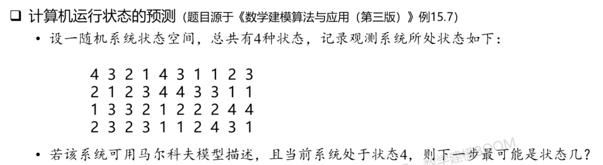
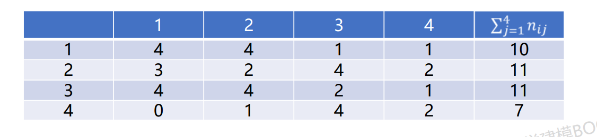

# 马尔科夫预测

---

## 引例

### 张三的日常

- 法外狂徒张三日常处于以下4种状态之一：行窃、吃喝嫖赌、逃亡和蹲大牢
- 若已知张三当前处于某种状态，则**他未来的状态只与现在有关，而与过去无关**
  - 例如已知昨天张三在吃喝嫖赌、现在张三在逃亡，**能影响明天的只有今天“逃亡”的状态**
  - 那么**明天的状态**只与**今天**的**“逃亡”**有关，而与**昨天**的“吃喝嫖赌”**无关**
- 注意，张三的状态是**随机的**，只能求明天处于每一种状态的**概率**
- 而这概率又只与今天的状态有关，不需要管昨天或更早的状态是什么
- 描述这种随机现象的模型，称为**马尔科夫模型**

## 马尔科夫链

### 关键概念

- **离散时间**：张三的昨天为初始时间 $n=1$，则今天为 $2$，明天为 $3$，以及以后的 $4,5,...$
- **状态空间**：张三处于行窃状态记为 $j=1$，则处于吃喝嫖赌、逃亡和蹲大牢依次记为 $2,3,4$
- **状态**：$X_n=j$ 表示第 $n$ 天张三处于状态 $j$，例如 $X_3=2$ 表示第 3 天张三处于吃喝嫖赌状态

### 马尔科夫链概念

设 $\{X_n,n=1,2,...\}$ 是一个随机序列（张三在第 n 天的状态是随机的）

根据马尔科夫模型的特征，未来的状态只与当下的状态有关，所以有如下的等式：

$$
  P\{X_{n+m}=i|X_n=i_n,...,X_2=i_2,X_1=i_1\}=P\{X_{m+m}=i|X_n=i_n\}
$$

既**条件概率**表达式中，一大堆的条件都是无用的，**只有第 n 天的条件才是有用的**！

## 适用赛题

### 健康与疾病

- **人的健康状态是会随着时间变化的**，而变化又是**随机**的
- 预测一个人下一年的健康状态，**只需要看当前的状态**，无需关系过去
- **可能与优化模型结合**，例如保险公司追求收益最大化，需要预测投保人的健康状态

### 销售与贮存

- 一些奢侈品例如钢琴，一般销量很小，**商店不会贮存太多**
- 钢琴每周的销售量也是**随机**的，进货贮存过多会积压资金，贮存过少又有可能失去销售机会
- 商家需要**根据一周的销量决定是否进货**

### 等级结构

- 工程师按照级别分为技术员、助理工程师、中级工程师、副高级工程师和高级工程师
- 一个人明年的级别也是**随机的**，无论升级还是降级都**只与其当前的级别有关**
- 预测下一年的级别变动，也可用马尔科夫预测

### 基本特点

状态**随机**，下一阶段的状态

## 典型例题与原理讲解

马尔科夫预测的原理将结合以下例题讲解：

### 时齐性

马尔科夫链分为**时齐的马尔科夫链**和**非时齐的马尔科夫链**，在讲解原理之前，我们先了解一下时齐的马尔科夫链具有的性质——**时齐性**

#### 概念解释

- 若第 $n$ 天张三处于状态 $i$，则经过了 $m$ 天后，张三处于状态 $j$ 的概率满足：

$$
  P\{X_{n+m}=j|X_n=i\}=P_{ij}(m)
$$

- 则称 $\{X_n,n=1,2,...\}$ 为时齐的马尔科夫链

#### 说明

- 上式表达的意思是：**两种状态转换的概率，只与时间间隔有关**，与更早的过去无关，也与起始时刻无关
- 满足这种条件的马尔科夫链，称为时齐的马尔科夫链，本节的例题的马尔科夫链都是时齐的
- 是否满足时齐，是**问题本身**决定的（通过查文献获得），一般带有周期性的问题才会满足时齐
  - 例如销售类问题，可以在论文的**模型假设**里写“假设销售规律满足时齐性”
- $m=1$ 时，称 $P_{ij}(1)$ 为**一步转移概率**，所有 $P_{ij}$ 所组成的矩阵称为马尔科夫链的**一步转移矩阵**
  - 如何求一步转移概率？
    - **问题内在规律推导**
    - **根据统计数据计算估计值**
    - **查文献**

### 例题求解

#### 求解一步转移矩阵

- 从状态 $i$ 到状态 $j$ 的概率的估计值为

$$
  \hat{P}_{ij}=\frac{n_{ij}}{\sum_{j=1}^{4}n_{ij}}
$$

- 例如，从状态 1 可以转移到状态 1、2、3、4，那么状态 1 转移到其他状态的总次数，就是观测到的数据中，出现 “11”、“12”、“13”和“14” 的总次数，也就是公式中的分母

- 可统计出如下表格

- 进一步，可以求出一步转移矩阵：

$$
  \begin{bmatrix}
  2/5 & 2/5 & 1/10 & 1/10 \\
  3/11 & 2/11 & 4/11 & 2/11 \\
  4/11 & 4/11 & 2/11 & 1/11 \\
  0 & 1/7 & 4/7 & 2/7
  \end{bmatrix}
$$

- 其中第 $i$ 行第 $j$ 列的数，代表着从状态 $i$ 转移到状态 $j$ 的概率的估计值
- 从状态转移矩阵中可以轻松看出，当前状态为 4，则下一步的状态最有可能是 3

### 进一步分析

#### n 步后的概率分布

- 假设该系统初始时 4 中状态出现的概率为 $P^{(0)}=[0.2,0.3,0.3,0.2]$
- 则系统初始化后，运行到第 2 步最优可能出现的状态是什么？第 5 步呢？
- 记初始概率分布的行向量为 $P^{(0)}$，一步转移概率矩阵记为 $P$
- 则第 n 步的状态的概率分布为

$$
  P^{(n)}=P^{(0)}P^n
$$

- 系统初始化后运行到第 2 步的概率分布 $P^{(2)}=P^{(0)}P^2=[0.291,0.289,0.271,0.149]$
- 系统初始化后运行到第 5 步的概率分布 $P^{(2)}=P^{(0)}P^5=[0.294,0.289,0.268,0.149]$
- **注意：**求 “第 n 步” 状态的概率分布吗，需要根据题目确定究竟是否把 “初始化” 算作第一步
- 系统初始时的概率分布行向量 $P^{(0)}$ 怎么求？
  - 问题内在规律推导
  - 根据统计数据计算估计值
  - 查文献

### 注意事项

#### 马尔科夫预测和其他预测有什么不同？

- 其他预测模型：计算的是 **“数值”**，理论上是**无数种可能**（常见实数集合）
- 马尔科夫预测：计算的是 **“概率”**，需要**有限种已知的可能结果**
  - 例如根据城市近几年的噪声值，预测下一年的噪声值之类的问题
    - 因为 “噪声值” 是数值，理论上可以是任何实数
    - 所以有无数种可能的结果，此时就不能用马尔科夫预测
  - 例如根据某销量很小的奢侈品过去几个月的销量，预测下个月销量
    - 某奢侈品的 “销量”只能是正整数
    - 又因为“销量很少”可以根据已知数据假定小于某个正整数（例如月销量不超过10）
    - 此时 “销量” 有0到10总共11个可能的结果
    - 可以用马尔科夫预测下个月的销量最有可能是几

#### 马尔科夫预测的重难点

- 本节的计算过程都非常简单，没有复杂原理、公式或推导
- 理解马尔科夫链的核心：**未来只与当前有关**、与过去无关，以及**时齐性**
- 后续的模拟退火，就是一个马尔科夫过程
- 能否用马尔科夫预测，是看问题本身决定的！
